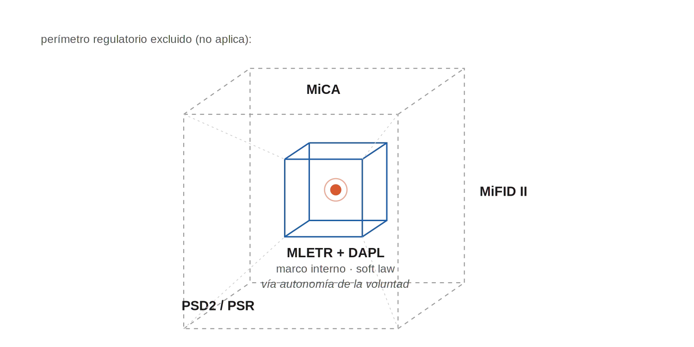
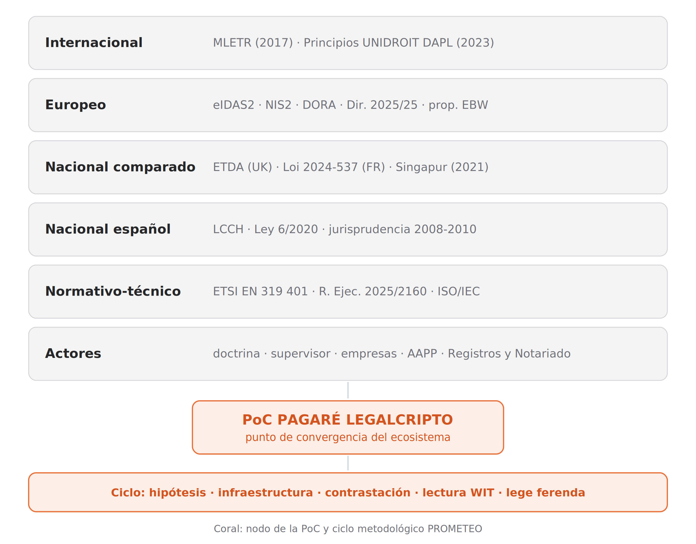
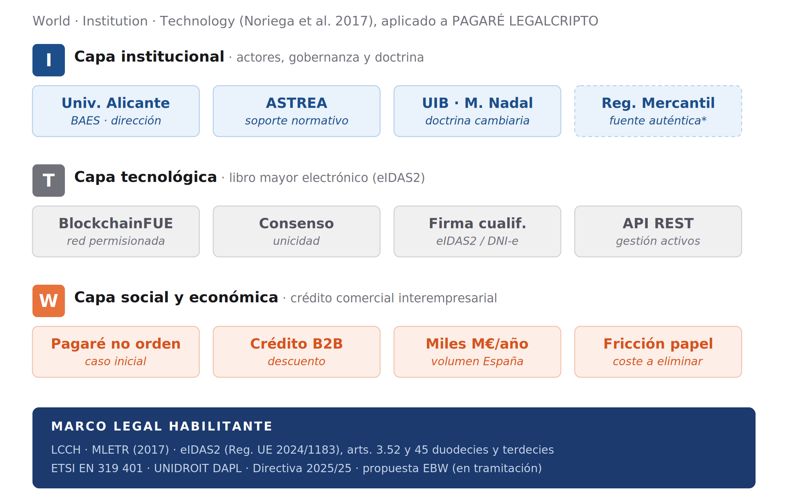

# El pagaré tokenizado

> Documento de referencia. Conversión a Markdown del original `EL PAGARÉ TOKENIZADO.docx`
> de **Mª del Carmen Pastor Sempere** (Universidad de Alicante), julio de 2026.
> Figuras en `docs/img/pagare-tokenizado-fig*.png`.
>
> **Convención editorial:** el original presenta tres frases truncadas (borrador sin
> cerrar). El texto reconstruido por conjetura de contexto va entre `⟦ ⟧`; **no es de
> la autora** y debe confirmarse con ella antes de citarlo. El resto es íntegro y sin
> edición. Los pasajes afectados son §2 (líneas de cierre sobre el *European Business
> Wallet*), §3.4 (arranque del párrafo sobre el primer problema) y §6 (cierre del
> párrafo sobre la genealogía del «registro electrónico»).

---

**Resumen:** La plena electronificación de los títulos cambiarios constituye una de las asignaturas pendientes más relevantes del Derecho mercantil español y, al mismo tiempo, una pieza necesaria para la competitividad del tejido empresarial en el mercado interior digital. España no ha seguido, hasta la fecha, la senda emprendida por otras economías europeas comparables, como el Reino Unido (Electronic Trade Documents Act 2023) o Francia (Loi n.º 2024-537, de 13 de junio de 2024), en la transposición de la Ley Modelo UNCITRAL sobre Documentos Transmisibles Electrónicos (MLETR, 2017). Frente a esa inacción legislativa, el trabajo sostiene que el ordenamiento europeo ofrece ya un anclaje normativo aprovechable: el régimen del libro mayor electrónico introducido por el Reglamento (UE) 2024/1183 (eIDAS2). Se examina, en concreto, si dicho régimen puede operar como vehículo de transposición material o de infraestructura del modelo MLETR para los títulos cambiarios electrónicos en Derecho español, mientras no se acometa su transposición formal. Identificado el problema de la unicidad como obstáculo doctrinal central, el estudio analiza las transposiciones nacionales europeas, el régimen del libro mayor electrónico de eIDAS2 y los Principios UNIDROIT sobre Activos Digitales y Derecho Privado. Desde la metodología «Law + Technology» y su evolución hacia el ecosistema legal inteligente, se aporta como evidencia empírica la prueba de concepto PAGARÉ LEGALCRIPTO, desarrollada sobre la red BlockchainFUE de la Universidad de Alicante para pagarés no a orden y configurada como libro mayor electrónico no cualificado a efectos de eIDAS2. El pagaré se aborda aquí más allá de su condición de título cambiario: opera como banco de pruebas de una infraestructura jurídica de confianza, en la que la resolución de la unicidad y del control permite proyectar seguridad jurídica sobre otros ámbitos de la contratación mercantil electrónica. El trabajo concluye con propuestas de lege ferenda orientadas a una transposición formal española que dote de plena seguridad jurídica al pagaré electrónico.

**Palabras clave:** pagaré electrónico; unicidad; control; libro mayor electrónico; eIDAS2; MLETR.

**Abstract:** The full electronification of negotiable instruments remains one of the most significant unresolved issues in Spanish commercial law and, at the same time, a necessary element for the competitiveness of the business sector within the digital internal market. Unlike other comparable European economies, such as the United Kingdom (Electronic Trade Documents Act 2023) and France (Loi n.º 2024-537 of 13 June 2024), Spain has not yet transposed the UNCITRAL Model Law on Electronic Transferable Records (MLETR, 2017). Against this legislative inaction, this article argues that European Union law already provides a usable normative anchor: the electronic ledger regime introduced by Regulation (EU) 2024/1183 (eIDAS2). It examines whether that regime may operate as a material or infrastructural transposition vehicle for the MLETR model in relation to electronic negotiable instruments under Spanish law, pending formal legislative transposition. After identifying the uniqueness problem as the central doctrinal obstacle, the article analyses European national transpositions, the eIDAS2 electronic ledger regime and the UNIDROIT Principles on Digital Assets and Private Law. Drawing on the «Law + Technology» methodology and its evolution toward the intelligent legal ecosystem, it offers as empirical evidence the PAGARÉ LEGALCRIPTO proof of concept, developed on the BlockchainFUE network of the University of Alicante for non-order promissory notes and configured as a non-qualified electronic ledger under eIDAS2. The promissory note is approached here beyond its value as a negotiable instrument: it operates as a testing ground for a legal infrastructure of trust, in which the resolution of uniqueness and control may project legal certainty onto other areas of electronic commercial contracting. The article concludes with lege ferenda proposals for a formal Spanish transposition capable of providing full legal certainty to the electronic promissory note.

**Keywords:** electronic promissory note; uniqueness; control; electronic ledger; eIDAS2; MLETR.

**Sumario:** 1. Introducción. 2. Delimitación del objeto. 3. El problema doctrinal de la unicidad de los títulos cambiarios electrónicos. 4. Marco comparado: las transposiciones nacionales europeas de la MLETR. 5. El marco europeo: el libro mayor electrónico del Reglamento (UE) 2024/1183. 6. Marco doctrinal: los Principios UNIDROIT sobre Activos Digitales y Derecho Privado. 7. Metodología: del Law+Technology al ecosistema legal inteligente. 8. La prueba de concepto PAGARÉ LEGALCRIPTO como nodo del ecosistema. 9. Conclusiones y propuestas de lege ferenda. Bibliografía.

------------------------------------------------------------------------

# 1. INTRODUCCIÓN

La electronificación del tráfico jurídico mercantil ha progresado de manera marcadamente desigual. Mientras la firma electrónica, la factura electrónica, la publicidad registral de los actos societarios o la contratación a distancia han alcanzado anclajes normativos consolidados, tanto en el Derecho español como en el de la Unión, los títulos cambiarios stricto sensu, y de modo señalado el pagaré (que constituirá el objeto preferente de cuanto sigue), han opuesto una singular resistencia a la digitalización plena. Conviene subrayar, ya de entrada, que esa resistencia no obedece a razones técnicas: la criptografía asimétrica, los servicios de confianza cualificados y, más recientemente, las tecnologías de registros distribuidos suministran instrumentos sobrados para reproducir, e incluso reforzar, las funciones probatorias e identificadoras que hasta ahora venía cumpliendo el soporte en papel. La resistencia es, a mi juicio, de orden estructural, y hunde sus raíces en la tensión no resuelta entre el régimen formal de la Ley 19/1985, de 16 de julio, cambiaria y del cheque, edificado sobre las nociones de soporte documental y de posesión física, y la naturaleza inmaterial del documento electrónico.

Esta tensión dista de ser una mera curiosidad doctrinal. El pagaré continúa siendo, en el tráfico mercantil español, uno de los instrumentos más empleados en las operaciones de crédito comercial interempresarial, señaladamente entre pequeñas y medianas empresas. Su empleo en soporte papel arrastra costes relevantes (de impresión, custodia, transporte físico y archivo), junto a fricciones operativas en la gestión y el cobro, que la digitalización permitiría eliminar. La imposibilidad práctica, hasta hoy, de utilizar pagarés electrónicos plenamente equivalentes a los de papel se erige, en este sentido, en una verdadera asignatura pendiente de nuestro Derecho mercantil, con consecuencias económicas apreciables para el conjunto del tejido empresarial y, en última instancia, para la competitividad de la economía española en el mercado interior.

Conviene advertir, ya desde estas primeras líneas, que el interés del pagaré trasciende su valor como título cambiario singular. Lo abordo aquí, a los efectos de la prueba de concepto que este trabajo examina, como paradigma de un instrumento mercantil llamado a operar en la economía digital del siglo XXI. Las soluciones que su electronificación reclama, en particular la garantía de unicidad y el control como sustituto funcional de la posesión, no se agotan en el ámbito cambiario: una vez articuladas sobre una infraestructura fiable y dotadas de reconocimiento jurídico suficiente, permiten proyectar seguridad jurídica sobre otros espacios de la contratación mercantil electrónica. El pagaré opera, así, como banco de pruebas de una arquitectura de confianza llamada a servir a un programa más amplio de modernización del Derecho privado patrimonial.

# 2. DELIMITACIÓN DEL OBJETO

El presente estudio arranca de una constatación de Derecho comparado que no debiera pasar por alto: España no ha seguido, hasta la fecha, la senda emprendida por otras economías europeas comparables en la transposición de la Ley Modelo UNCITRAL sobre Documentos Transmisibles Electrónicos (UNCITRAL, 2017). Singapur lo hizo en 2021, mediante la Electronic Transactions (Amendment) Act; el Reino Unido, en 2023, mediante la Electronic Trade Documents Act; y Francia, en 2024, mediante la Loi n.º 2024-537. Otras jurisdicciones, como Alemania, Bélgica o los países nórdicos, han iniciado ya los correspondientes trabajos preparatorios. En España, en cambio, ninguna iniciativa legislativa ha asumido todavía la equivalencia funcional plena entre los títulos cambiarios en papel y sus homólogos electrónicos.

Esta laguna normativa española no es, sin embargo, sinónimo de inactividad europea. En paralelo a las transposiciones nacionales de la MLETR, la Unión Europea ha procedido a una reforma estructural de su marco de servicios de confianza mediante el Reglamento (UE) 2024/1183, en lo sucesivo eIDAS2, que ha introducido, entre otras novedades, una Sección 11 dedicada a los libros mayores electrónicos (artículos 45 duodecies y 45 terdecies). La definición que el nuevo artículo 3.52 eIDAS ofrece de "libro mayor electrónico" (secuencia de registros electrónicos de datos que garantiza la integridad de dichos registros y la exactitud de su orden cronológico) constituye, a mi juicio, una respuesta europea estructuralmente equivalente al concepto MLETR de "método fiable". Esta equivalencia, aunque parcial, ofrece un anclaje normativo aprovechable mientras se materializa la transposición sustantiva en Derecho español.

La hipótesis que el presente estudio sostiene y argumenta es, por consiguiente, doble. En primer lugar, que el régimen del libro mayor electrónico no cualificado introducido por eIDAS2 puede servir como vehículo de transposición material (en el sentido de soporte de infraestructura) del modelo MLETR para los títulos cambiarios electrónicos, aun cuando la transposición formal del régimen sustantivo requerirá necesariamente una modificación legislativa de la LCCH. En segundo lugar, que esta tesis no se formula en términos puramente especulativos: encuentra confirmación empírica en la prueba de concepto PAGARÉ LEGALCRIPTO que se desarrolla en la Universidad de Alicante sobre la red permisionada BlockchainFUE.

Metodológicamente, el trabajo se inscribe en la continuidad del enfoque ya aplicado a una prueba de concepto anterior del mismo equipo investigador sobre el caso del dinero programable local, primera materialización empírica del modelo. Como en aquella, aplico la metodología «Law + Technology» (Pastor Sempere, Martínez Palomares y Llopis Vañó, 2022, sobre la base de Schrepel, 2021) en su evolución hacia el ecosistema legal inteligente (Pastor Sempere, 2026), con apoyo en el metamodelo WIT (World, Institution, Technology) (Noriega et al., 2017) como herramienta analítica. La sección séptima desarrollará en detalle el aparato metodológico; la octava lo ilustrará operativamente mediante la lectura WIT de la PoC PAGARÉ LEGALCRIPTO.

Conviene precisar, ya en sede introductoria, el ámbito de aplicación del trabajo y sus exclusiones. La PoC y, por consiguiente, el análisis doctrinal que aquí se desarrolla, se limitan en su fase inicial a los pagarés no a orden. Esta elección no es meramente prudencial: responde a una identificación correcta del nivel mínimo de complejidad técnica que la infraestructura debe resolver. En los pagarés no a orden, el problema de la unicidad se reduce al momento de la creación; en los pagarés a la orden, transmisibles por endoso, se prolonga a lo largo de toda la cadena de endosos, multiplicando las exigencias del método fiable. La fase posterior de la PoC abordará los pagarés a la orden; el presente trabajo se circunscribe, por consiguiente, al caso más simple, sin perjuicio de avanzar criterios doctrinales aplicables a la fase posterior.

Conviene, asimismo, delimitar el objeto de manera negativa, esto es, por exclusión de los regímenes que no le resultan aplicables. El pagaré electrónico tokenizado no es un medio de pago en el sentido de la normativa de servicios de pago, por lo que queda al margen de la Directiva (UE) 2015/2366 (PSD2). Tampoco debe quedar sujeto al Reglamento (UE) 2023/1114 (MiCA) por la mera utilización de tecnología de registro distribuido: en la configuración examinada, el token no opera como criptoactivo autónomo ofrecido al público o admitido a negociación, sino como registro electrónico de control de un derecho cambiario o crediticio subyacente. Con todo, la calificación MiCA deberá depender siempre del diseño concreto del activo, de su negociabilidad y de su función económica. Y no es, en fin, un valor negociable sometido a la normativa del mercado de valores: aunque el legislador español ha abierto para los valores representados mediante tecnología de registro distribuido un carril propio (el de la acción ejecutiva del artículo 517 de la Ley de Enjuiciamiento Civil, en la redacción dada por la Ley 6/2023), ese cauce se reserva a los valores negociables y no alcanza al pagaré cambiario singular que aquí se examina.

La conclusión no queda alterada por la reforma actualmente en curso del marco europeo de servicios de pago. La Comisión presentó en 2023 el paquete PSD3/PSR, integrado por una nueva Directiva de servicios de pago y por un Reglamento de servicios de pago destinado a reforzar la armonización, la prevención del fraude y la protección de los usuarios. El Parlamento Europeo y el Consejo alcanzaron un acuerdo político provisional sobre ambos textos el 27 de noviembre de 2025, posteriormente aprobado por la Comisión ECON el 5 de mayo de 2026. Hasta su adopción formal y publicación en el Diario Oficial de la Unión Europea, el régimen vigente sigue estando constituido por PSD2 y por las normas nacionales de transposición; y, aun después de la entrada en aplicación del nuevo paquete, la premisa conceptual se mantiene: el pagaré electrónico, en cuanto título cambiario o documento transmisible electrónico, no debe confundirse sin más con una operación de pago ni con un instrumento de pago en sentido técnico-regulatorio (Parlamento Europeo, 2025; Consejo de la Unión Europea, 2025; Parlamento Europeo, 2026).

Esta triple exclusión proyecta, además, una consecuencia en el plano de la prevención del blanqueo de capitales que conviene explicitar. La «regla del viaje» de la Recomendación 16 del GAFI, articulada en la Unión por el Reglamento (UE) 2023/1113 sobre la información que acompaña a las transferencias de fondos y de determinados criptoactivos, impone que los datos de ordenante y beneficiario acompañen a cada «transferencia de fondos» (noción anclada, a su vez, en los conceptos de la normativa de servicios de pago) y a cada transferencia de criptoactivos ejecutada por un proveedor de servicios de criptoactivos. En la medida en que la circulación del pagaré electrónico no constituya una operación de pago en sentido PSD2 (y, en su momento, del marco PSD3/PSR que resulte finalmente adoptado) ni una transferencia de criptoactivos ejecutada por un proveedor de servicios de criptoactivos, su circulación cambiaria (el endoso o, en la infraestructura que este trabajo examina, la transferencia del control sobre el libro mayor electrónico) permanece fuera del perímetro objetivo de esa obligación de acarreo de datos, cuyo régimen general he descrito con detalle en otro lugar (Pastor Sempere, 2026). La precisión no es menor: la naturaleza pro solvendo del título (que no extingue por sí la obligación subyacente, sino que se entrega para facilitar o asegurar el cobro) localiza el momento eventualmente sujeto a la regla del viaje no en la circulación del pagaré, sino en su liquidación final, cuando ésta se produzca mediante una operación de pago ejecutada por un proveedor de servicios de pago. La delimitación negativa opera, por tanto, también frente al régimen de transparencia de la prevención del blanqueo, y confina la identificación reforzada al extremo de la liquidación, y no a cada eslabón de la cadena de transmisión del título.

Delimitado así negativamente el objeto, el marco aplicable se encuentra en el soft law jurídico-privado: la MLETR, como instrumento específico sobre el documento transmisible, y los Principios UNIDROIT sobre Activos Digitales y Derecho Privado (DAPL), como marco general sobre el activo digital. Conviene, además, distinguir dos planos que el análisis tiende a confundir: el de la naturaleza y la circulación del título (donde operan la MLETR y los DAPL) y el de su ejecución, que permanece regido por la Ley de Enjuiciamiento Civil. Es en este segundo plano donde se localiza un obstáculo de primer orden, pues la doctrina jurisprudencial del Tribunal Supremo exige, para el acceso al juicio cambiario, la aportación del documento original (Sentencia de la Sala Primera núm. 94/2014, de 5 de marzo), exigencia que solo una reforma de la Ley Cambiaria y del Cheque y de la propia Ley de Enjuiciamiento Civil permitiría superar.

Figura 1. Delimitación negativa del objeto. El pagaré electrónico se sitúa entre el perímetro regulatorio excluido, servicios de pago (PSD2 y reforma PSD3/PSR), criptoactivos (MiCA) y valores negociables (MiFID II), y el marco interno de soft law jurídico-privado (MLETR y Principios UNIDROIT DAPL), que opera a través de la autonomía de la voluntad. Fuente: elaboración propia.

La estructura del estudio responde a esta lógica. La sección tercera identifica el problema doctrinal de la unicidad como obstáculo central a la admisibilidad del pagaré electrónico. La cuarta examina el marco comparado, con atención particular a las transposiciones europeas. La quinta analiza el régimen del libro mayor electrónico del eIDAS2. La sexta lo articula con el marco doctrinal de los Principios UNIDROIT DAPL. La séptima expone la metodología. La octava presenta la PoC PAGARÉ LEGALCRIPTO y ofrece su lectura WIT. La novena cierra con conclusiones y propuestas de lege ferenda.

Somos plenamente conscientes, no obstante, de que la prueba de concepto que aquí presento no agota ni resuelve por sí sola la entera problemática del pagaré electrónico; antes al contrario, buena parte de su valor reside en delimitar con precisión lo que la infraestructura actual cubre y lo que resta por edificar. Precisamente por ello dejo apuntadas, ya desde esta sede introductoria, las líneas por las que la investigación habrá de proseguir: la articulación entre el libro mayor electrónico no cualificado y los regímenes nacionales europeos de transposición de la MLETR, con los problemas de Derecho internacional privado y de competencia que su generalización suscitará; la integración del libro mayor electrónico con la Cartera Europea de Identidad Digital, una vez ésta entre en operación generalizada; la acreditación del poder de representación societaria a través del European Business Wallet y de la fuente auténtica registral, como capa que completaría la cadena del pagaré de empresa; el régimen de responsabilidad de los prestadores no cualificados de servicios de libro mayor electrónico frente a los titulares de los activos registrados; la minimización de los datos personales en tránsito, moviendo identidad verificable en lugar de datos identificables, como respuesta al riesgo de eslabón débil que aquejará a los regímenes de transparencia contra el blanqueo de capitales, señaladamente la Recomendación 16 del GAFI, cuando su desarrollo alcance a las infraestructuras de libro mayor electrónico (Pastor Sempere y De Koker, 2026); y la delicada articulación del régimen concursal del titular del control con la operatoria de la red de registros distribuidos. Con todo ello, más que dar por cerrada una cuestión, aspiro a trazar el mapa del nuevo Derecho mercantil digital, del que el pagaré electrónico constituye, a mi juicio, una de sus piezas inaugurales.

En efecto, el presente estudio deja abiertas varias líneas de investigación que merecerían tratamiento autónomo, y que dejo enunciadas como mapa del nuevo Derecho mercantil digital en construcción. Me detengo aquí, siquiera brevemente, en la que reviste mayor relevancia para la continuidad inmediata del proyecto.

Una línea de evolución de particular relevancia es la articulación del libro mayor electrónico con la capa de identidad y representación societaria del ecosistema europeo de carteras. Si la fase inicial de la prueba de concepto resuelve la unicidad en el plano técnico (epígrafe 3.4), la plena eficacia del pagaré de empresa electrónico exige resolver, además, la acreditación del poder de representación del firmante. La integración del libro mayor electrónico con el European Business Wallet (y, a su través, con la fuente auténtica registral del cargo o del poder inscrito) ofrece la vía para cerrar ese segundo problema, una vez que la propuesta COM(2025) 838 cristalice en Derecho vigente y resulte aplicable el poder de representación digital de la Directiva (UE) 2025/25. A ello ⟦se dedica el epígrafe 8.7, al examinar el horizonte de integración de la prueba de concepto con la Cartera Europea de Identidad Digital y con la capa de representación societaria de fuente registral.⟧

La PoC PAGARÉ LEGALCRIPTO, en su evolución hacia las fases posteriores (pagarés a la orden, integración con sistemas de liquidación y pago, e integración con las carteras europeas y nacionales de identidad digital), ofrecerá, previsiblemente, casos de estudio empíricos para abordar varias de estas cuestiones. La continuidad metodológica con la PoC AL-COIN y la consolidación del modelo del ecosistema legal inteligente como marco analítico permiten anticipar, además, que los aprendizajes de cada iteración contribuirán al refinamiento progresivo tanto de la doctrina como de las herramientas analíticas. La investigación en este campo, en suma, no se concibe como una secuencia de aportaciones aisladas sino como un proceso iterativo de construcción de conocimiento articulado en torno a casos de uso sucesivos[^1].

La materialización de las propuestas de lege ferenda anteriores, si llegara a producirse, configuraría además un cierre natural del ciclo investigador: la hipótesis doctrinal previa, validada por la PoC, recogida por la práctica empresarial y, eventualmente, sancionada por el legislador. Este recorrido (de la teoría a la práctica y de la práctica al Derecho positivo) es, en última instancia, la aspiración propia del modelo metodológico del ecosistema legal inteligente que el presente estudio ha contribuido a desarrollar.

# 3. EL PROBLEMA DOCTRINAL DE LA UNICIDAD DE LOS TÍTULOS CAMBIARIOS ELECTRÓNICOS

## 3.1. La estructura formal del pagaré en la Ley Cambiaria

Conviene partir del régimen positivo, pues en él residen a un tiempo la fortaleza del instrumento y la raíz de su resistencia a la digitalización. El pagaré es, en nuestro Derecho, un título-valor cambiario que incorpora una promesa pura y simple de pagar una cantidad determinada de dinero en un vencimiento determinado, sometido a una disciplina formal cuya densidad no cabe soslayar. El artículo 94 LCCH enumera, en efecto, siete requisitos formales esenciales: la denominación de "pagaré" inserta en el texto del título, la promesa pura y simple de pagar una cantidad determinada, la indicación del vencimiento (con previsión supletoria de pagadero a la vista), el lugar en que el pago haya de efectuarse, el nombre de la persona a quien deba hacerse el pago o a cuya orden deba hacerse, la fecha y lugar de emisión, y la firma del que emite el título, denominado firmante. A ellos se añade, ex artículo 96 LCCH, la aplicación al pagaré de las normas relativas a la letra de cambio en cuanto sean compatibles con su naturaleza, lo que extiende a este instrumento el régimen del aval, del endoso (cuando el pagaré es a la orden) y del protesto.

Esta arquitectura formal presupone, históricamente, un soporte documental. La LCCH habla de "el título" como continente físico de las declaraciones cambiarias; la posesión es el modo de legitimación cambiaria por excelencia (artículo 19 LCCH para la letra de cambio, aplicable al pagaré por la remisión del artículo 96); la entrega es el mecanismo de transmisión cuando concurre el endoso. Como ha señalado la doctrina cambiaria clásica, los conceptos de "posesión" y "entrega" denotan implícitamente la naturaleza documental de los títulos cambiarios, y una interpretación literal y estricta de la LCCH conduciría a considerar el soporte papel como elemento consustancial del instrumento (Vicent Chuliá, 2024).

La cuestión, sin embargo, no es tan inequívoca como pudiera parecer. El propio régimen general español, desde la entrada en vigor de la Ley 59/2003 de firma electrónica, y de manera más estructural tras la aplicación del Reglamento (UE) n.º 910/2014 (eIDAS) y su modificación por el Reglamento (UE) 2024/1183, ha generalizado el principio de equivalencia funcional, conforme al cual la firma electrónica produce los mismos efectos jurídicos que la firma manuscrita (artículo 25 eIDAS). El artículo 326.2 de la Ley de Enjuiciamiento Civil reconoce la fuerza probatoria de los documentos electrónicos; el artículo 3 de la Ley 6/2020, reguladora de determinados aspectos de los servicios electrónicos de confianza, articula su régimen complementario. De ello podría inducirse, en una primera aproximación, la admisibilidad inmediata del pagaré electrónico, considerando satisfechos por equivalencia los requisitos de forma escrita y firma.

Conviene, antes de avanzar hacia el problema de la unicidad, precisar el alcance del formalismo cambiario, pues la cuestión suele plantearse en términos equívocos. Es lugar común afirmar que el Derecho mercantil consagra la libertad de forma (el artículo 51 del Código de Comercio reconoce la validez de los contratos mercantiles cualquiera que sea la forma en que se celebren, con la salvedad genérica que el artículo 52 reserva a los contratos que deban reducirse a escritura o requieran solemnidades necesarias para su eficacia). Pero el verdadero problema del pagaré electrónico no se sitúa en el plano de la forma de la declaración de voluntad. Como advirtió con precisión Díaz Moreno (2014), la exigencia de un soporte material en los títulos cambiarios no es una mera exigencia de forma (caso en el que podría operar el principio de equivalencia funcional), sino el presupuesto de hecho de aplicación de un determinado régimen jurídico que, privado de ese referente corpóreo, carece en gran medida de sentido. La cuestión no es, por tanto, si rige la libertad de forma o su excepción, sino si el régimen cambiario presupone un soporte documental que el documento electrónico, por su naturaleza, no puede por sí solo satisfacer. A esta reformulación (y a su matización) se dedican los párrafos siguientes.

El formalismo que la Ley Cambiaria impone es, sin embargo, un formalismo de contenido, no de soporte. El artículo 94 enumera las menciones esenciales del título, pero en ningún punto exige expresamente el papel como soporte material: las nociones de «título», «firma» y «posesión» han sido leídas tradicionalmente en clave documental, mas no contienen una reserva legal de soporte en papel. Es en ese silencio (y no en una inexistente libertad de forma) donde se abre el espacio para el pagaré electrónico: un soporte electrónico que incorpore las menciones del artículo 94 y satisfaga, por equivalencia funcional (artículo 25 del Reglamento eIDAS y artículo 3 de la Ley 6/2020), las funciones de autenticación e integridad propias de la firma manuscrita. La distinción pertinente no es, pues, la de forma libre frente a forma impuesta, sino la de neutralidad de soporte dentro de un formalismo de contenido que permanece intacto. Conviene advertir que esta lectura es discutida: la doctrina cambiaria dominante (Vicent Chuliá, 2024; Díaz Moreno, 2014) sostiene que la naturaleza documental no es un mero silencio normativo, sino constitutiva del régimen, de modo que la plena admisibilidad del pagaré electrónico reclama, más que una reinterpretación del Derecho vigente, una reforma legislativa expresa.

En ese espacio operan precisamente los instrumentos de soft law que este trabajo analiza, la MLETR y los DAPL. Por su naturaleza no vinculante, su eficacia no deriva de la imposición normativa sino de la autonomía de la voluntad: son las partes quienes, al adoptar un sistema electrónico que articule el control sobre el activo, incorporan a su relación las soluciones que estos instrumentos proponen. Ahora bien, esta vía tiene un límite preciso: la autonomía de la voluntad permite dotarse de un instrumento de promesa de pago plenamente eficaz inter partes, pero no puede, por sí sola, conferir a ese instrumento el régimen cambiario privilegiado (la abstracción, la autonomía de las obligaciones, la oponibilidad erga omnes y el acceso al juicio cambiario), pues tal régimen es de configuración legal y no de libre creación por la autonomía privada. De ahí que el soft law fundamente la naturaleza y la circulación del pagaré electrónico, pero no supla la reforma legislativa que su plena eficacia cambiaria reclama.

## 3.2. La insuficiencia de la equivalencia funcional: la unicidad como obstáculo estructural

Esta primera aproximación es, sin embargo, insuficiente, como ha argumentado convincentemente Martínez Nadal (2026) en su contribución doctrinal a la presente investigación. La equivalencia funcional entre firma manuscrita y firma electrónica resuelve los problemas de autenticación (saber quién firma) e integridad (saber que el contenido no ha sido alterado) del documento individualmente considerado, pero no resuelve el problema de fondo que la digitalización plantea respecto de los títulos cambiarios: el problema de la unicidad.

Por la propia naturaleza de los documentos electrónicos (reducibles a una secuencia de bits y, por consiguiente, susceptibles de copia perfecta e ilimitada) resulta imposible distinguir, prima facie, el ejemplar original de cualquiera de sus copias. Toda copia es estructuralmente idéntica al original; toda firma electrónica es válida en todas las copias; toda integridad criptográfica se verifica indistintamente en cualesquiera ejemplares. El soporte electrónico no admite, sin más, la distinción ontológica entre original y copia que el régimen del título-valor presupone.

Esta dificultad es trivial en la inmensa mayoría de los documentos electrónicos: nadie pretende hablar de "original" y "copia" de un correo electrónico, de una factura electrónica o de un contrato firmado digitalmente, porque su función económica no exige la unicidad. Pero en los títulos cambiarios la unicidad es elemento estructural del régimen: la posesión del título (es decir, la tenencia material) legitima al tenedor; la transmisión del título, incluso en formas no traslativas de la propiedad como el endoso en garantía, exige que el transmitente se desprenda del título. Si el documento electrónico puede ser copiado idénticamente, el tenedor puede multiplicar las copias y endosarlas sucesivamente a distintos endosatarios, sin que ninguno de ellos pueda saberlo. El resultado sería una cadena de tenedores legítimos que compiten entre sí por un crédito que, por definición, no admite duplicación.

Como advierte Martínez Nadal, nada impediría, en este escenario, que uno o varios endosatarios realicen múltiples copias del pagaré recibido, endosándolas, nuevamente, a múltiples endosatarios. De forma que, al final de esta cadena de actuaciones, podrían existir múltiples tenedores de distintas copias de lo que, en origen, era un único pagaré, sin que sea posible distinguir el original inicial de las múltiples copias posteriores. La firma electrónica y la infraestructura de clave pública que la sostiene no resuelven este problema: cada firma electrónica seguirá siendo válida en cada copia, porque la firma no es propiedad excluyente del documento original.

La consecuencia jurídica es importante. Un sistema de pagarés electrónicos que no resuelva la unicidad implica un sistema en el que el deudor podría verse obligado a pagar varias veces el mismo crédito, en el que los acreedores cambiarios competirían entre sí por un patrimonio insuficiente, en el que las acciones de regreso se multiplicarían inconsistentemente, y en el que la propia función económica del título (proporcionar al acreedor un instrumento de crédito incorporado a un documento) se vería gravemente comprometida. Es por esta razón estructural (y no por mero apego formalista al soporte papel) por lo que la doctrina cambiaria mayoritaria ha sostenido históricamente que la digitalización plena de los títulos cambiarios requiere algo más que la simple aplicación del principio de equivalencia funcional. Esta insuficiencia no es privativa del título cambiario. En sede general del activo digital, he subrayado en otro lugar (Pastor Sempere, 2026) que la mera posesión de una copia no acredita la titularidad del token, pues cualquiera que disponga de una réplica idéntica podría reclamarla, y que diversas iniciativas legislativas han identificado la controlabilidad, la singularidad y la rivalidad como características definitorias del activo digital, esto es, como propiedades que el sistema debe asegurar frente a la replicación. Es precisamente ese déficit de singularidad del soporte, común al activo digital y al título-valor electrónico, el que la infraestructura de libro mayor electrónico viene a colmar.

## 3.3. La jurisprudencia española y los intentos doctrinales previos

La jurisprudencia española se ha pronunciado en dos ocasiones (en 2008 y 2010) sobre la admisibilidad de pretendidos pagarés electrónicos. Ambos pronunciamientos, marcados por un apego al régimen documental de la LCCH, denegaron la consideración cambiaria de los instrumentos planteados. La doctrina ha valorado críticamente estas decisiones, pero la falta de un marco normativo claro impide, hasta el día de hoy, formular alternativas concluyentes en sede de aplicación judicial.

Las soluciones doctrinales y prácticas propuestas hasta la fecha en Derecho español han girado, fundamentalmente, en torno a la figura del tercero de confianza: una entidad (pública, privada o mixta; centralizada o federada) que actuaría como depositaria de los títulos electrónicos y certificaría, en cada momento, quién es el tenedor legítimo. Esta solución, aunque viable, presenta limitaciones evidentes (Madrid Parra, 2018). Requiere la existencia de una entidad fiduciaria sólida, sujeta a régimen regulatorio y supervisión, y reproduce, en sede digital, los costes y las fricciones del sistema documental tradicional. El tercero de confianza se convierte, de hecho, en una forma de "papel digitalizado": la unicidad se garantiza por la confianza en el tercero, no por las propiedades intrínsecas del soporte electrónico.

La aparición de las tecnologías de registros distribuidos abre una alternativa estructuralmente distinta: la unicidad puede garantizarse no por la confianza en un tercero, sino por las propiedades criptográficas y consensuales del propio sistema de registro. En un registro distribuido bien diseñado, la doble transmisión de un mismo activo digital es técnicamente imposible: el consenso entre nodos verifica, antes de validar cualquier transacción, que el activo no ha sido transmitido previamente a otra dirección. La unicidad emerge, por consiguiente, no de la fe en un fiduciario, sino de la arquitectura misma del sistema.

Esta sustitución funcional (de la confianza fiduciaria por la verificación criptográfica) constituye el núcleo de la propuesta que el presente estudio sostiene. La PoC PAGARÉ LEGALCRIPTO, que examinaré en la sección octava, opera precisamente sobre esta hipótesis: utilizar una red permisionada (BlockchainFUE) configurada como libro mayor electrónico no cualificado a efectos del Reglamento eIDAS2 para resolver, en el plano técnico, el problema de la unicidad del pagaré electrónico, mientras se proporciona, en el plano jurídico, el anclaje normativo europeo aplicable.

## 3.4. Dos problemas distintos: la unicidad y la identidad y representación del firmante

El análisis precedente permite formular una distinción que la doctrina tiende a confundir y que resulta, sin embargo, decisiva para el diseño de cualquier infraestructura de pagaré electrónico: la electronificación del título plantea no uno, sino dos problemas de naturaleza diversa, que se resuelven en planos diferentes y mediante instrumentos distintos.

⟦El primero es el problema de la unicidad, examinado en los epígrafes precedentes: impedir que un mismo título electrónico pueda existir y circular simultáneamente en más de un ejemplar. Se resuelve, conforme a cuanto antecede,⟧ en el plano de la infraestructura técnica (en términos del metamodelo WIT que la sección séptima desarrollará, el plano de la *Technology*), mediante el consenso del libro mayor electrónico, que impide la doble transmisión. Conviene, no obstante, una precisión normativa de primer orden: la unicidad que el consenso garantiza es una unicidad técnica, que no debe confundirse con la presunción legal de unicidad. Esta última, conforme al artículo 45 duodecies, apartado 2, del Reglamento eIDAS2, se reserva a los registros contenidos en un libro mayor electrónico *cualificado*, que gozan de la presunción de unicidad, de exactitud de su orden cronológico secuencial y de integridad. El libro mayor electrónico no cualificado (el que la prueba de concepto emplea en su fase inicial) resuelve la unicidad en el plano fáctico, pero no se beneficia de aquella presunción, cuyo disfrute requeriría la cualificación del prestador conforme al artículo 45 terdecies del mismo Reglamento.

El segundo problema es de naturaleza distinta y se sitúa en otro plano. Es el problema de la identidad del firmante y, cuando el título lo emite una sociedad, de su poder de representación: que quien firma sea quien dice ser, que tenga capacidad y que, cuando firma en nombre de una persona jurídica, esté facultado para obligarla. El artículo 94, apartado 7, de la Ley Cambiaria y del Cheque exige la firma del que emite el título; pero «firma», en sede cambiaria, no se agota en un acto criptográfico de autenticación: es la imputación jurídica de la declaración cambiaria a un sujeto dotado de capacidad y, en su caso, de poder de representación. La firma electrónica cualificada resuelve la autenticación y la integridad (saber quién firma y que el contenido no se ha alterado), pero no acredita por sí sola la legitimación representativa de quien firma en nombre de la sociedad. Este segundo problema es independiente de la limitación a los pagarés no a orden que delimita el presente trabajo: se suscita siempre que el firmante es una persona jurídica, con abstracción de la cláusula de circulación.

La distinción tiene una consecuencia de diseño que conviene explicitar, pues cada problema se ancla en instrumentos distintos del propio ecosistema europeo. La identidad de la persona física que materialmente firma se sustenta en la Cartera Europea de Identidad Digital y en la firma electrónica cualificada del régimen eIDAS2 (extremo que la sección 8.7 desarrolla). La acreditación del poder de representación societaria, en cambio, corresponde a una capa que el ordenamiento europeo está aún construyendo: la del European Business Wallet, cuya propuesta de Reglamento \[COM(2025) 838 final, de 19 de noviembre de 2025, procedimiento 2025/0358(COD)\] prevé la circulación de credenciales verificables de representación cuya fuente auténtica son los registros mercantiles, en articulación con el certificado de sociedad de la UE y el poder de representación digital introducidos por la Directiva (UE) 2025/25 del Parlamento Europeo y del Consejo, de 19 de diciembre de 2024.

Dos cautelas resultan ineludibles. La primera, de vigencia temporal: el European Business Wallet es una propuesta en tramitación, no Derecho vigente, y el poder de representación digital de la Directiva (UE) 2025/25 no será aplicable, en lo sustancial, hasta el 1 de agosto de 2028. La cadena completa del pagaré de empresa con representación verificable mediante credenciales constituye, por tanto, arquitectura objetivo y no solución implementable a la fecha de este estudio; en la fase actual de la prueba de concepto, la representación se acredita aún por medios convencionales (nota simple o copia autorizada del poder), documentándose como el punto que la integración con las carteras vendrá a resolver. La segunda cautela es de delimitación funcional: la aportación registral a esta arquitectura se circunscribe a la publicidad y la oponibilidad frente a terceros del cargo o del poder inscrito, sin alcanzar la verificación del otorgamiento del poder, que en el sistema español corresponde a la función notarial y que la propia Directiva (UE) 2025/25 reserva a la comprobación, por «un juez, notario u otra autoridad competente», de la identidad, la capacidad y la legitimación del otorgante.

En suma, la prueba de concepto que este trabajo examina resuelve en términos técnicos el primero de los dos problemas (la unicidad, en el plano técnico) y aísla con precisión el segundo (la identidad y la representación, en el plano institucional) como frontera de investigación. No se trata de una debilidad metodológica, sino de la delimitación rigurosa de lo que la infraestructura actual cubre y de lo que la evolución del ecosistema europeo de identidad está llamada a completar. A esta segunda línea se vuelve en el epígrafe 8.7.

# 4. MARCO COMPARADO: LAS TRANSPOSICIONES NACIONALES EUROPEAS DE LA MLETR

## 4.1. La Ley Modelo UNCITRAL sobre Documentos Transmisibles Electrónicos: arquitectura conceptual

No cabe calibrar la posición española sin atender, antes, al modelo internacional del que se aparta y a las jurisdicciones que ya lo han hecho suyo. La Comisión de las Naciones Unidas para el Derecho Mercantil Internacional aprobó en 2017 la Ley Modelo sobre Documentos Transmisibles Electrónicos (MLETR), culminación de más de una década de trabajos preparatorios. El instrumento es, en términos técnicos, un modelo legislativo (no un convenio), lo que permite a las jurisdicciones adaptarlo a sus particularidades nacionales preservando un núcleo conceptual común. Esta naturaleza no vinculante, lejos de constituir una debilidad, ha facilitado la adopción del modelo en jurisdicciones de tradiciones jurídicas muy diversas, desde el common law anglosajón hasta los sistemas civilistas continentales.

El núcleo conceptual de la MLETR se articula en torno a tres ideas fundamentales (Goldby, 2019). La primera es la equivalencia funcional: un documento electrónico transmisible producirá los mismos efectos jurídicos que su equivalente en papel cuando cumpla determinadas condiciones, estableciendo así una correspondencia funcional entre los dos soportes que evita la consagración legislativa de uno u otro. La segunda es el método fiable (reliable method, artículo 12 MLETR): el sistema empleado para gestionar el documento electrónico debe satisfacer un conjunto de requisitos funcionales (entre ellos, la unicidad, la integridad y la trazabilidad) susceptibles de evaluación caso por caso, con criterios no preceptivos sino orientativos. La tercera, y conceptualmente más innovadora, es el control (control, artículos 10 y 11 MLETR) como sustituto funcional de la posesión: el equivalente de la posesión física de un título es, en sede electrónica, el control exclusivo sobre el registro electrónico que incorpora el derecho.

Esta tríada (equivalencia funcional, método fiable y control) constituye el aparato conceptual mediante el cual la MLETR resuelve el problema de la unicidad. El control exclusivo, garantizado por el método fiable, asegura que sólo una persona puede, en cada momento, ejercer los derechos incorporados al documento, y que la transmisión de esos derechos se opera mediante la transferencia del control de un sujeto a otro. La unicidad se garantiza, no por la imposibilidad técnica de copiar el registro (que existe), sino por la imposibilidad estructural de que más de una copia confiera, simultáneamente, control exclusivo. La singularidad del título-valor electrónico no es, por consiguiente, una singularidad del soporte, sino una singularidad de la relación jurídica entre el titular y el sistema.

La técnica legislativa de la MLETR se caracteriza, además, por su neutralidad tecnológica. La norma no prescribe el uso de blockchain, ni de PKI centralizada, ni de ninguna otra tecnología concreta. Define los requisitos funcionales que el método fiable debe satisfacer y deja a las partes (o, en su caso, a las autoridades de supervisión) la verificación caso por caso del cumplimiento. Esta neutralidad responde tanto a consideraciones de pragmatismo (evitar el envejecimiento prematuro de la norma) como a consideraciones de competencia tecnológica (no privilegiar a una solución técnica sobre otras). Como se verá, esta característica se ha preservado en las transposiciones nacionales examinadas a continuación.

## 4.2. Singapur (2021): primera transposición plena

Singapur fue la primera jurisdicción importante en transponer plenamente la MLETR mediante la Electronic Transactions (Amendment) Act 2021, que modificó la Electronic Transactions Act 2010 incorporando el régimen MLETR. La transposición fue acompañada de una decidida apuesta institucional: en mayo de 2023 se ejecutó la primera operación transfronteriza con un título transmisible electrónico (de Singapur a Tailandia), y el régimen ha servido de modelo para iniciativas posteriores en otras jurisdicciones del sudeste asiático. La técnica legislativa es paradigmática del enfoque MLETR: incorpora literalmente los conceptos de control exclusivo y método fiable, articulándolos con el régimen general de la Electronic Transactions Act, y precisa los requisitos funcionales que el sistema técnico debe satisfacer.

## 4.3. Reino Unido: la Electronic Trade Documents Act 2023

El Reino Unido aprobó la Electronic Trade Documents Act 2023 (en lo sucesivo, ETDA), sancionada el 20 de julio de 2023 y en vigor desde el 20 de septiembre de 2023. La norma fue elaborada a propuesta de la Law Commission, sobre la base de un análisis comparado extenso y de los trabajos de UNCITRAL (Law Commission, 2022). La ETDA constituye una transposición plena de la MLETR adaptada a la técnica del common law: breve en su articulado (catorce secciones), funcional en sus definiciones, abierta a la práctica en su aplicación.

La ETDA opera sobre dos definiciones articuladas. La sección 1 define el paper trade document como un documento de un tipo comúnmente utilizado en el Reino Unido en relación con el comercio o transporte de mercancías, o la financiación de tales operaciones, y cuya posesión sea legalmente exigible para reclamar el cumplimiento de una obligación. La sección 1(2) lista ocho ejemplos (no taxativos) de tales documentos: la letra de cambio (bill of exchange), el pagaré (promissory note), el conocimiento de embarque (bill of lading), la orden de entrega del buque (ship's delivery order), el recibo de depósito (warehouse receipt), el mate's receipt, la póliza de seguro marítimo (marine insurance policy) y el certificado de seguro de carga (cargo insurance certificate).

La sección 2(2) define el electronic trade document estableciendo cuatro requisitos del reliable system empleado, cuya literalidad merece transcripción: (a) the system used to create, manage and transfer the document must enable the document to be identified in a way that distinguishes it from any copies; (b) the system must protect the document against unauthorised alteration; (c) it must not be possible at any time for more than one person to exercise control of the document; (d) any person who is able to exercise control of the document must be able to demonstrate that they are able to exercise control.

La norma adopta así, expresamente, la noción MLETR de control como sustituto funcional de la posesión, y resuelve el problema de la unicidad mediante el requisito de exclusividad del control. Es destacable que la ETDA no impone tecnología alguna: el reliable system puede ser una blockchain, un sistema centralizado de registro o cualquier otra arquitectura técnica que satisfaga los cuatro requisitos. Tampoco crea un régimen administrativo de acreditación: la verificación de la fiabilidad se realiza, en última instancia, en sede contractual y judicial.

La sección 3 ETDA establece la equivalencia funcional: un electronic trade document tendrá los mismos efectos jurídicos que su equivalente en papel; la posesión, el endoso y la entrega del documento electrónico producirán los efectos jurídicos correspondientes. La sección 4 regula la conversión entre soportes (de papel a electrónico y viceversa), garantizando que el cambio de soporte no altera el contenido jurídico del título. El conjunto ofrece una solución legislativa sintética, funcional y técnicamente neutra, sustentada en el extenso trabajo preparatorio publicado por la propia Law Commission británica (Law Commission, 2022).

## 4.4. Francia: la Loi n.º 2024-537 du 13 juin 2024

Francia adoptó la Loi n.º 2024-537, denominada "Loi visant à accroître le financement des entreprises et l'attractivité de la France", que constituye, hasta la fecha, la transposición continental más completa y sistemática de la MLETR. A diferencia de la ETDA británica (que mantiene una técnica legislativa de common law, con definiciones funcionales y delegación a la práctica), la ley francesa articula un régimen sistemático en sus artículos 14 a 16, complementado por modificaciones específicas en el Código de Comercio, el Código de Seguros, el Código Monetario y Financiero y el Código de Transportes.

El artículo 14 de la Ley define el titre transférable como el escrito que representa un bien o un derecho y que confiere a su portador el derecho de exigir el cumplimiento de la obligación especificada en él, así como el de transferir ese derecho. Enumera ocho categorías de títulos transmisibles susceptibles de transposición electrónica. La primera (y más relevante para el propósito del presente estudio) es ineludible: "1° Les lettres de change et les billets à ordre régis par le titre Ier du livre V du code de commerce". Las letras de cambio y los pagarés franceses entran, por tanto, dentro del régimen MLETR transpuesto, sin necesidad de interpretación analógica.

El artículo 15 articula la equivalencia funcional. El apartado II define al portador del título transmisible electrónico como aquél que dispone, por sí o por tercero, "de son contrôle exclusif". Este control exclusivo le permite ejercer los derechos conferidos por el título, modificarlo y transmitirlo. El apartado V completa la construcción normativa: "Le transfert ou le nantissement des droits conférés par le titre transférable électronique lors de l'endossement ou de la simple remise de ce titre s'opère par le transfert du contrôle exclusif exercé sur ce titre". La transferencia del título-valor electrónico opera por transferencia del control exclusivo. El paralelismo con el régimen MLETR es completo, y la economía conceptual de la norma francesa la convierte en modelo de referencia para los sistemas civilistas europeos.

El artículo 16 fija las cinco condiciones que el método fiable debe satisfacer para que el título transmisible electrónico produzca los mismos efectos que su equivalente en papel: (1°) garantizar la unicidad del título; (2°) identificar al portador como persona con control exclusivo; (3°) establecer el control exclusivo del portador; (4°) identificar a los firmantes y portadores sucesivos desde la creación hasta su extinción; y (5°) preservar la integridad, evaluada con remisión al artículo 1366 del Código Civil francés (que regula el escrito electrónico). Un décret en preparación a la fecha de este estudio precisará los requisitos técnicos del método fiable.

## 4.5. Arquitectura conceptual común y posición española

De la triple referencia comparada (Singapur, Reino Unido, Francia) emerge una arquitectura conceptual común, susceptible de formulación abstracta. El régimen MLETR exige, para que el título electrónico produzca los efectos jurídicos del título en papel, que el sistema técnico subyacente garantice cinco propiedades fundamentales: unicidad del registro, identificación del titular del control, exclusividad de ese control, trazabilidad de la cadena de portadores sucesivos e integridad de la información incorporada. Estas cinco propiedades son, en última instancia, requisitos funcionales: la norma no prescribe una tecnología concreta, sino que define los outputs que la tecnología debe entregar.

Esta arquitectura conceptual común proporciona el criterio de comparación frente al cual cabe evaluar la cobertura que el Derecho de la Unión Europea ofrece, en ausencia de transposición específica de la MLETR en Derecho español. La cuestión que la sección siguiente aborda es si el régimen del libro mayor electrónico introducido por eIDAS2 satisface estos cinco requisitos funcionales (en lo que constituye el plano de la infraestructura) y, por consiguiente, puede servir como vehículo de transposición material del modelo MLETR aun en ausencia de transposición formal.

La posición española en este paisaje comparado es, como adelantaba, particular: España no ha seguido la senda emprendida por sus economías comparables. No sólo carece de un régimen análogo al ETDA británico o a los artículos 14 a 16 de la Loi francesa, sino que tampoco ha emprendido los trabajos preparatorios para una transposición de la MLETR. La iniciativa legislativa, en este caso, requeriría una modificación específica de la LCCH, articulada con el régimen general de servicios electrónicos de confianza. La presente investigación aspira, entre otros objetivos, a ofrecer los elementos doctrinales y técnicos que tal iniciativa reclamaría, y a mostrar que el camino no queda reservado de forma exclusiva a la intervención legislativa.

# 5. EL MARCO EUROPEO: EL LIBRO MAYOR ELECTRÓNICO DEL REGLAMENTO (UE) 2024/1183

## 5.1. La modificación operada por eIDAS2: marco general

Llego así al eje de la tesis que aquí se sostiene: el anclaje europeo. El Reglamento (UE) 2024/1183, de 11 de abril de 2024, ha modificado de manera estructural el Reglamento (UE) n.º 910/2014. El propósito principal de eIDAS2 es el establecimiento de un marco europeo de identidad digital articulado en torno a la European Digital Identity Wallet (Cartera Europea de Identidad Digital), pero la reforma ha aprovechado para introducir, ampliar y precisar el catálogo de servicios de confianza. Entre las novedades, dos son centrales para mi propósito: el régimen reforzado de los prestadores no cualificados de servicios de confianza (nuevo artículo 19 bis) y la introducción de una Sección 11 dedicada a los libros mayores electrónicos (artículos 45 duodecies y 45 terdecies).

La técnica legislativa europea, en este caso, es la propia del Reglamento: aplicación directa en los Estados miembros, sin necesidad de norma de transposición nacional. Esto significa que el régimen del libro mayor electrónico es, desde la entrada en vigor de eIDAS2 (20 de mayo de 2024), Derecho español directamente aplicable, sin perjuicio del desarrollo técnico que los actos de ejecución de la Comisión están proporcionando progresivamente. La consecuencia es relevante: cualquier infraestructura técnica que se configure como libro mayor electrónico en territorio español opera bajo el régimen del Reglamento eIDAS2, no bajo un régimen nacional específico, sin perjuicio de las normas españolas complementarias en materia de servicios electrónicos de confianza (Ley 6/2020).

## 5.2. La noción de libro mayor electrónico (artículo 3.52 eIDAS)

La definición que el nuevo artículo 3.52 eIDAS ofrece de libro mayor electrónico es particularmente sintética. Su literalidad merece transcripción: «Libro mayor electrónico»: secuencia de registros electrónicos de datos que garantiza la integridad de dichos registros y la exactitud de su orden cronológico.

El artículo 3.53 añade la noción de libro mayor electrónico cualificado: el libro mayor electrónico proporcionado por un prestador cualificado de servicios de confianza que cumple los requisitos del artículo 45 terdecies. La articulación con el régimen del prestador cualificado (auditoría previa, inclusión en la lista de confianza nacional, presunción reforzada de fiabilidad) sigue la lógica general del Reglamento eIDAS para las modalidades cualificadas de los servicios de confianza.

Conviene detenerse en la economía de la definición del artículo 3.52. Sus dos exigencias materiales (integridad de los registros y exactitud de su orden cronológico) coinciden, en lo sustancial, con dos de las cinco propiedades funcionales que la MLETR exige al método fiable: integridad de la información incorporada y trazabilidad de la cadena de portadores. Las tres propiedades restantes (unicidad, identificación del titular del control y exclusividad del control) no figuran expresamente en el artículo 3.52, pero pueden articularse en sede de los requisitos generales aplicables a los prestadores de servicios de confianza y, en particular, a las prácticas establecidas por las normas de referencia, como se verá a continuación.

Esta articulación (que examinaré en detalle más adelante) es la que permite sostener que el régimen del libro mayor electrónico eIDAS2 constituye una respuesta europea estructuralmente equivalente al concepto MLETR de método fiable. No es una equivalencia perfecta ni explícita (el legislador europeo no ha pretendido transponer la MLETR), pero es una equivalencia funcional sustancial, susceptible de articulación doctrinal y de aplicación práctica.

## 5.3. El régimen de los prestadores no cualificados (artículo 19 bis eIDAS)

El nuevo artículo 19 bis eIDAS establece los requisitos aplicables a los prestadores no cualificados de servicios de confianza. La norma exige que estos prestadores cuenten con políticas adecuadas y adopten medidas oportunas para la gestión de riesgos jurídicos, empresariales, operativos y otros riesgos directos o indirectos. Incluye obligaciones específicas de notificación al organismo de supervisión (en el plazo de 24 horas) en caso de violación de seguridad o interrupción del servicio con impacto significativo, articulándose con el régimen NIS2 de notificación de incidentes.

El desarrollo técnico de estas obligaciones se ha producido mediante el Reglamento de Ejecución (UE) 2025/2160, que establece las normas de referencia, especificaciones y procedimientos para la gestión de riesgos en la prestación de servicios de confianza no cualificados. Su anexo remite, entre otros documentos, a la norma técnica ETSI EN 319 401, en su versión V3.1.1 (2024-06). La versión más reciente de esta norma es la V3.2.1 (2026-01), aprobada en enero de 2026, cuya incorporación por referencia al acto de ejecución se encuentra pendiente de revisión por la Comisión. Esta norma técnica articula la concreción operativa de las exigencias del Reglamento de Ejecución y de la Directiva NIS2.

Es importante subrayar el alcance de este régimen. Aunque eIDAS2 distingue entre prestadores cualificados y no cualificados, el régimen del prestador no cualificado no es un régimen "de baja exigencia". La norma exige un nivel sustancial de cumplimiento en materia de gestión de riesgos, ciberseguridad, continuidad operativa y notificación de incidentes. La diferencia esencial con el régimen cualificado radica en la auditoría previa y en la inclusión en la lista nacional de confianza (que confieren al prestador cualificado una presunción reforzada de fiabilidad), pero las exigencias técnicas y organizativas básicas son sustancialmente comparables.

## 5.4. El régimen del libro mayor electrónico cualificado (artículo 45 terdecies eIDAS)

El artículo 45 terdecies establece los requisitos aplicables a los libros mayores electrónicos cualificados, desarrollados por el Reglamento de Ejecución (UE) 2025/2531, que fija las normas y especificaciones de referencia para esta categoría de servicio. En paralelo, el Reglamento de Ejecución (UE) 2025/2530 de la misma fecha regula los requisitos generales de los prestadores cualificados de servicios de confianza.

A los efectos del presente estudio, el régimen del LME cualificado interesa por contraste: precisamente porque exige el cumplimiento de una serie de requisitos adicionales (entre ellos, la auditoría previa, la inclusión en la lista de confianza nacional y la presunción reforzada de fiabilidad), el régimen cualificado opera como referencia de máximo nivel. La prueba de concepto PAGARÉ LEGALCRIPTO no aspira, en su fase inicial, a la cualificación, pero su análisis sirve para identificar las exigencias funcionales del nivel inmediatamente inferior, el no cualificado, que es el aplicable al caso. La trayectoria natural del proyecto, si la PoC se consolida y se extiende a entornos productivos, contemplaría progresivamente la cualificación como objetivo de medio plazo.

## 5.5. Articulación con NIS2 y con ETSI EN 319 401

El régimen de los servicios de confianza eIDAS2 se complementa con la Directiva (UE) 2022/2555 (NIS2) en materia de ciberseguridad, aplicada a los prestadores de servicios de confianza por su consideración como entidades de Infraestructura Digital (Anexo I, NIS2). Su desarrollo técnico se contiene en el Reglamento de Ejecución (UE) 2024/2690 de la Comisión, que detalla, entre otras cuestiones, los umbrales para la consideración de un incidente como significativo a efectos del artículo 23.3 de la Directiva.

La norma técnica de referencia es la ETSI EN 319 401, en su versión V3.1.1 (2024-06), cuya estructura organiza los requisitos en torno a la valoración del riesgo (apartado 5), las políticas y declaraciones de prácticas de confianza (apartado 6) y la organización operativa del prestador (apartado 7). Esta norma técnica articula la concreción operativa de las exigencias del Reglamento de Ejecución 2025/2160 y de la Directiva NIS2, y es el referente normativo-técnico al que debe ajustarse cualquier infraestructura que pretenda configurarse como libro mayor electrónico no cualificado.

La articulación entre estos tres niveles normativos (el Reglamento eIDAS2, los reglamentos de ejecución y la norma técnica ETSI) configura un marco regulatorio integrado que combina la flexibilidad de la legislación marco con la precisión de la normativa técnica. Es un modelo característico del Derecho europeo digital reciente, articulado en torno a la cooperación entre legislador, autoridades de supervisión y organismos de normalización, y que ofrece una arquitectura de cumplimiento sofisticada pero accesible para las entidades sujetas.

## 5.6. Análisis de cobertura: el plano de la infraestructura

Llegados a este punto, puedo formular un análisis preliminar de la cobertura que el régimen del LME del eIDAS2 ofrece sobre los cinco requisitos funcionales MLETR. Recapitulo: el método fiable MLETR debe garantizar (i) unicidad del registro, (ii) identificación del titular del control, (iii) exclusividad de ese control, (iv) trazabilidad de la cadena de portadores y (v) integridad de la información incorporada.

La definición del artículo 3.52 eIDAS aborda directamente dos de estos cinco requisitos: la integridad de los registros (requisito v) y la exactitud de su orden cronológico (requisito iv, trazabilidad). Los tres restantes no figuran en la definición, pero son consustanciales a la naturaleza de cualquier libro mayor electrónico con pretensión de fiabilidad: una secuencia de registros electrónicos que garantice integridad y orden cronológico debe necesariamente incorporar mecanismos que impidan la duplicación inconsistente de los activos registrados (unicidad), identifiquen al titular del control sobre cada activo (identificación) e impidan que más de una persona ejerza simultáneamente ese control (exclusividad).

En la práctica, las redes de tecnología de registros distribuidos (que constituyen una de las arquitecturas técnicas más maduras para implementar libros mayores electrónicos) resuelven los tres requisitos restantes mediante el consenso entre nodos (unicidad) y la criptografía asimétrica (identificación y exclusividad). Las normas técnicas ETSI EN 319 401 y los reglamentos de ejecución conexos proporcionan, además, el marco operativo para que estas garantías técnicas se documenten, se auditen y se hagan oponibles en sede jurídica. La traslación de estas garantías al caso concreto de una red permisionada configurada como libro mayor electrónico no cualificado ha sido objeto de análisis específico (Alamillo-Domingo, 2026), al que se remite la sección 8.2.

La conveniencia de esta lectura en clave de infraestructura se ve reforzada por el análisis reciente de Gómez Yubero, Gullón Ojesto e Iglesias-Rodríguez (2026) sobre la transformación tecnológica de la compensación europea. Aunque su objeto inmediato son las entidades de contrapartida central y la poscontratación financiera, su tesis resulta trasladable al presente trabajo: la DLT incrementa la trazabilidad, la eficiencia y la automatización de ciertas funciones, pero no elimina los riesgos jurídicos, operativos, de liquidez, de gobernanza y de ciberseguridad; los redistribuye y, en determinados diseños, puede incluso amplificarlos. De ahí que la tecnología distribuida deba insertarse en una arquitectura institucional de confianza, con reglas de gobernanza, interoperabilidad, continuidad y supervisión claras, y no presentarse como sustituto autosuficiente del marco jurídico. Esta cautela encaja con la tesis aquí defendida: el libro mayor electrónico no cualificado proporciona un soporte de infraestructura aprovechable, pero no sustituye ni la cualificación cuando se busque presunción legal reforzada, ni la reforma cambiaria necesaria para la plena eficacia del título.

La conclusión preliminar que cabe extraer es la siguiente: el régimen del LME no cualificado del eIDAS2, articulado con los reglamentos de ejecución y la normativa técnica ETSI, ofrece una cobertura sustancialmente equivalente a los cinco requisitos funcionales del método fiable MLETR. Esta cobertura es, no obstante, parcial en un sentido específico: opera en el plano de la infraestructura pero no resuelve la cuestión sustantiva del régimen del título-valor. A esta cuestión (y a la propuesta de articulación de ambos planos) dedicaré las secciones siguientes.

# 6. MARCO DOCTRINAL: LOS PRINCIPIOS UNIDROIT SOBRE ACTIVOS DIGITALES Y DERECHO PRIVADO

El anclaje en la infraestructura que acabo de describir reclama, para sostenerse cabalmente, un fundamento doctrinal a su altura, que hallo en los Principios UNIDROIT sobre Activos Digitales y Derecho Privado (DAPL), adoptados por el Consejo de Dirección de UNIDROIT en su 102.ª sesión, celebrada en Roma del 10 al 12 de mayo de 2023. Los DAPL son un instrumento de soft law de vocación universal, construido sobre los principios de neutralidad tecnológica, jurisdiccional y organizativa, que define el activo digital (al solo efecto de delimitar su ámbito de aplicación) como un registro electrónico susceptible de ser sujeto a control. A diferencia de la MLETR, que opera sobre el documento transmisible, los DAPL articulan el régimen jurídico-privado del activo digital en sentido amplio; ambos instrumentos se complementan, pues, sin solaparse: la MLETR aporta la equivalencia funcional del soporte y los DAPL el aparato conceptual de la titularidad y la circulación.

El estado de la cuestión ha avanzado de manera decisiva con la publicación, en acceso abierto, de los dos volúmenes colectivos preparados en el marco del Proyecto PROMETEO LegalCripto: la edición inglesa de comentarios, que dirijo con Morán Bovio (Springer, 2026), y la edición española, que dirijo y coordinan Morán Bovio y Echebarría Sáenz (Comares, 2026), que ofrece la primera traducción consensuada al español de los diecinueve Principios. Ambas obras permiten anclar el análisis que sigue en fuentes ya consolidadas.

Entre esas reflexiones reviste, a los efectos que aquí interesan, particular relevancia la que dediqué al Principio 2, sobre las definiciones (Pastor Sempere, 2026), en la que muestro que la noción de «registro electrónico», que el Principio 2(1) sitúa en el centro del sistema, no es una creación original de los DAPL, sino que bebe de dos fuentes normativas primarias: el «controllable electronic record» del Artículo 12 del Código de Comercio Uniforme estadounidense (enmiendas de 2022) y, muy señaladamente, el «registro electrónico» de la propia MLETR en su versión española oficial. Esta genealogía no es anecdótica: confirma que el concepto europeo de libro mayor electrónico y el concepto MLETR de método fiable comparten un mismo sustrato conceptual, lo que refuerza la tesis de equivalencia que este trabajo sostiene. Más aún, en esa Reflexión sitúo la genealogía en conexión directa con el Derecho europeo: al glosar la noción de registro electrónico, traigo a colación (Pastor Sempere, 2026) el considerando 68 del Reglamento (UE) 2024/1183, conforme al cual los libros electrónicos son una secuencia de registros de datos electrónicos que ha de garantizar su integridad y la exactitud de su orden cronológico. Esta lectura, que aproxima el «registro electrónico» de los DAPL a la definición eIDAS2 de libro mayor electrónico, respalda desde la doctrina la equivalencia estructural que la sección quinta de este trabajo sostiene entre el artículo 3.52 eIDAS y las propiedades funcionales del método fiable de la MLETR. Y la convergencia ha quedado además refrendada, en el plano de las Naciones Unidas, ⟦por los trabajos de la CNUDMI sobre documentos transmisibles electrónicos, cuya noción de registro electrónico comparte con los DAPL y con el libro mayor electrónico del eIDAS2 un mismo sustrato conceptual.⟧

Para el pagaré electrónico, tres aportaciones de la obra resultan especialmente pertinentes. La primera, situada entre los capítulos introductorios, es la de Illescas (2026), que examina el derecho de control sobre los documentos electrónicos negociables y las mercancías electrónicamente documentadas: constituye el puente conceptual entre los DAPL, la MLETR y el título cambiario, al situar el control (y no la posesión física del documento) como criterio que sustituye a la tenencia documental en el entorno electrónico. La segunda es la de Martínez Nadal (2026), autora de la reflexión sobre el Principio 4 (activos vinculados, linked assets), que aborda la cuestión nuclear del pagaré tokenizado: la existencia, los requisitos y los efectos del enlace entre el activo digital (el token) y el derecho subyacente (el crédito cambiario) que aquel representa. Es esta vinculación la que permite sostener que la transmisión del control sobre el activo digital arrastra la titularidad del crédito incorporado.

El concepto que vertebra el sistema es el de control, objeto del Principio 6 en la reflexión de Echebarría (2026). Los DAPL desplazan el eje desde la posesión hacia el control, entendido como la capacidad fáctica y exclusiva de obtener sustancialmente los beneficios del activo digital, de impedir que otros lo hagan y de transferir esa capacidad a un tercero; concepto que opera, en la propia caracterización del instrumento, como equivalente funcional de la posesión de los bienes tangibles. A él se anuda el Principio 7, sobre la identificación de la persona que ejerce el control (en conexión con la Cartera Europea de Identidad Digital del eIDAS2), que aporta el eslabón entre el control técnico y la identidad jurídica del tenedor. Este desplazamiento de la posesión al control ofrece el fundamento jurídico-privado para que un pagaré carente de soporte físico pueda, no obstante, circular y legitimar a su tenedor.

La relevancia de los DAPL en el contexto del presente trabajo se proyecta en tres planos. En primer lugar, ofrecen un puente conceptual entre la lógica MLETR (centrada en los documentos transmisibles electrónicos) y la realidad más amplia de los activos digitales tokenizados, que pueden representar derechos cambiarios pero también otros tipos de derechos (valores negociables, derechos reales, criptoactivos puros). En segundo lugar, los DAPL ofrecen criterios para resolver problemas que las transposiciones nacionales no han abordado expresamente: la concurrencia de control entre varios sujetos, la transferencia del control entre jurisdicciones, las consecuencias de la pérdida del control, o la articulación con los regímenes de insolvencia. En tercer lugar, los DAPL proporcionan el aparato conceptual para articular la relación entre el activo digital (el registro electrónico) y el derecho subyacente (el crédito cambiario), cuestión central para los títulos cambiarios electrónicos.

Los DAPL, en este sentido, complementan el régimen MLETR sin solaparlo: mientras la MLETR opera específicamente sobre los documentos transmisibles (categoría jurídica con perfiles propios en cada ordenamiento), los DAPL operan sobre los activos digitales en sentido amplio, ofreciendo un marco doctrinal aplicable también a supuestos no estrictamente cambiarios. La PoC PAGARÉ LEGALCRIPTO se sitúa, conceptualmente, en la intersección de los tres marcos: la MLETR como modelo de transposición, eIDAS2 como anclaje en la infraestructura europea y los DAPL como marco doctrinal articulador. Esta triple sustentación es lo que, a mi juicio, dota al proyecto de la robustez conceptual necesaria para afrontar el examen crítico de la doctrina cambiarista clásica.

La articulación de los DAPL con el régimen MLETR y con el régimen europeo del LME plantea, además, cuestiones interesantes de Derecho internacional privado. Cuando la transmisión de un título cambiario electrónico se opera entre jurisdicciones con regímenes de transposición distintos (por ejemplo, entre un emisor francés y un endosatario británico) surgen problemas de calificación, de eficacia transfronteriza del control exclusivo y de articulación de las normas de conflicto. Los DAPL ofrecen criterios doctrinales para abordar estas cuestiones (Principio 5), aunque la práctica europea está todavía por consolidar. Estas cuestiones, que excederían el marco del presente estudio, constituyen una de las líneas de investigación futura que la sección final del trabajo identificará.

# 7. METODOLOGÍA: DEL LAW+TECHNOLOGY AL ECOSISTEMA LEGAL INTELIGENTE

## 7.1. La metodología «Law + Technology»

Toda la construcción precedente descansa sobre una opción metodológica que conviene ahora explicitar, pues de ella depende la solidez de cuanto sigue. La presente investigación se inscribe en la tradición del enfoque «Law + Technology», sistematizado en sede europea por Schrepel (2021) y aplicado de manera consistente por el grupo BAES Blockchain Lab de la Universidad de Alicante en sus trabajos previos sobre activos digitales y dinero programable (Pastor Sempere, Martínez Palomares y Llopis Vañó, 2022). Esta metodología parte de una premisa que la experiencia investigadora confirma reiteradamente: el análisis jurídico aislado y el análisis tecnológico aislado tienden a producir, respectivamente, falsos problemas doctrinales y soluciones técnicas inviables jurídicamente. La integración de ambas perspectivas en sede investigadora permite, por una parte, evitar el planteamiento de problemas que la tecnología ya ha resuelto (el típico caso del jurista que continúa formulando preguntas relativas a problemas técnicamente superados), y, por otra, evitar el desarrollo de soluciones técnicas cuya legalidad sea cuestionable (el simétrico caso del tecnólogo que diseña sistemas sin atender al marco normativo aplicable).

La aplicación del enfoque «Law + Technology» al caso del pagaré electrónico permite identificar, en sede investigadora previa al diseño, varias cuestiones que la doctrina jurídica tradicional había planteado de manera incompleta. La principal es la propia caracterización del problema de la unicidad. En la doctrina cambiarista clásica, la unicidad se planteaba como un obstáculo conceptual de carácter doctrinal: el documento electrónico, por su naturaleza copiable, no podía ser título-valor. La integración del análisis tecnológico permite reformular el problema: la unicidad no es un atributo del soporte, sino del sistema. Un soporte electrónico copiable puede, no obstante, sustentar un sistema en el que la unicidad se preserve por consenso criptográfico. El problema no es, por consiguiente, conceptualmente irresoluble en sede electrónica; es técnicamente resoluble si se diseña adecuadamente la arquitectura del sistema.

Esta reformulación, característica del enfoque «Law + Technology», desplaza el foco de la discusión: de la imposibilidad ontológica a las condiciones técnicas de posibilidad. Y es precisamente esta reformulación la que la MLETR articula a nivel internacional: el método fiable no es un atributo de la tecnología empleada sino del sistema, evaluado en función de los requisitos funcionales que garantiza.

## 7.2. Evolución metodológica: el ecosistema legal inteligente

La metodología «Law + Technology», sin embargo, presenta limitaciones cuando el objeto de análisis no es ya una solución técnica específica frente a un marco normativo concreto, sino un fenómeno regulatorio complejo en el que confluyen múltiples actores (administración, supervisor, ciudadanía, sector privado, organismos normalizadores), múltiples niveles regulatorios (ético, técnico, blando, duro) y ciclos iterativos de validación. Para estos supuestos, el grupo PROMETEO ha venido desarrollando una evolución metodológica que denomino ecosistema legal inteligente (Pastor Sempere, 2026).

La diferencia fundamental entre ambos marcos puede formularse así: «Law + Technology» articula dos perspectivas (la jurídica y la tecnológica) sobre un objeto regulatorio individual; el ecosistema legal inteligente articula múltiples niveles regulatorios concurrentes, múltiples actores y ciclos iterativos de validación. Lo que en la primera era una integración bidimensional, en el segundo es una integración pluridimensional con retroalimentación temporal.

Aplicado al caso del pagaré electrónico, el marco del ecosistema legal inteligente permite articular las distintas capas que confluyen en la cuestión: (i) el nivel internacional (MLETR, DAPL UNIDROIT); (ii) el nivel europeo (eIDAS2, NIS2, DORA); (iii) el nivel nacional comparado (transposiciones MLETR británica, francesa, singapurense); (iv) el nivel nacional español (LCCH, Ley 6/2020, jurisprudencia); (v) el nivel normativo-técnico (ETSI EN 319 401, normas ISO/IEC); (vi) el nivel de los actores (desde la doctrina académica al regulador, pasando por el sector empresarial y las administraciones territoriales); y (vii) los ciclos iterativos de validación (entre el diseño técnico, la valoración doctrinal, la práctica jurídica y la eventual recepción legislativa). La articulación de todos estos niveles, con sus actores y sus ciclos, configura el ecosistema en el que la cuestión del pagaré electrónico se plantea y, eventualmente, se resolverá.

Entre los niveles que el ecosistema legal inteligente articula, el de la inteligencia artificial reviste una relevancia creciente. La construcción de una cadena de valor ética y jurídica de la inteligencia artificial como soporte del ecosistema financiero europeo, cuestión que Casanovas (2026) aborda con una propuesta operativa, conecta el nivel normativo-técnico del análisis con las exigencias del Reglamento (UE) 2024/1689, de 13 de junio de 2024, de inteligencia artificial, y del marco de resiliencia operativa digital (DORA), que la Figura 2 sitúa en el nivel europeo del ecosistema.

*Figura 2. El ecosistema legal inteligente del pagaré electrónico: niveles regulatorio-normativos y actores que convergen en la prueba de concepto PAGARÉ LEGALCRIPTO, sometida a un ciclo iterativo de validación (hipótesis, infraestructura, contrastación, lectura WIT y propuesta de lege ferenda). Fuente: elaboración propia.*

## 7.3. El metamodelo WIT como instrumento analítico

Para operar dentro de este ecosistema con rigor analítico, he venido aplicando el metamodelo WIT (World, Institution, Technology) elaborado por Noriega et al. (2017). El metamodelo WIT, originario del ámbito de los sistemas multiagentes y de la inteligencia artificial distribuida, ha demostrado en mi práctica investigadora una notable utilidad para el análisis de fenómenos socio-jurídico-técnicos complejos.

La lógica interna del metamodelo puede formularse del modo siguiente: cualquier objeto socio-técnico susceptible de análisis puede descomponerse en tres planos articulados. El plano del World (W) recoge la realidad material y social subyacente: en el presente caso, la realidad económica del crédito comercial, las prácticas empresariales del descuento de pagarés, los flujos de pagos interempresariales en territorio español. El plano de la Institution (I) recoge las normas, principios y categorías jurídicas aplicables: en el presente caso, la LCCH, el régimen eIDAS2, las transposiciones MLETR comparadas, los DAPL. El plano de la Technology (T) recoge la infraestructura técnica que permite materializar el objeto: en el presente caso, las redes de registros distribuidos, los protocolos criptográficos, los estándares ETSI.

La utilidad del metamodelo radica en que permite identificar con precisión los problemas que cada plano resuelve y los que no. El problema de la unicidad, por ejemplo, es un problema del plano W que requiere solución en el plano T y reconocimiento en el plano I. La equivalencia funcional es una construcción del plano I que articula los planos W y T. La transposición material es un caso particular en el que un plano I sustituye funcionalmente a otro plano I ausente (en el presente caso, el régimen LME del eIDAS2 sustituye funcionalmente al régimen MLETR español ausente). La lectura WIT, en este sentido, no es una metáfora ilustrativa sino un instrumento analítico operativo.

En la sección que sigue aplicaré este instrumento a la lectura sistemática de la prueba de concepto PAGARÉ LEGALCRIPTO, en la que el aparato metodológico expuesto encontrará, su materialización empírica.

*Figura 3. Arquitectura institucional de la prueba de concepto bajo el metamodelo WIT (World, Institution, Technology; Noriega et al., 2017): capa institucional, capa tecnológica y capa social y económica, sobre una banda de marco legal habilitante. Fuente: elaboración propia.*

# 8. LA PRUEBA DE CONCEPTO PAGARÉ LEGALCRIPTO COMO NODO DEL ECOSISTEMA

## 8.1. Contexto institucional y conexión con la PoC AL-COIN

Cuanto antecede permanecería en el plano de la hipótesis si no se acompañara de una contrastación empírica suficiente; a ese fin se orienta la prueba de concepto que examino en esta sección. La prueba de concepto PAGARÉ LEGALCRIPTO se desarrolla en el marco del Proyecto PROMETEO LegalCripto (CIPROM/2022/26), financiado por la Generalitat Valenciana y dirigido desde la Universidad de Alicante. El proyecto coordina una colaboración técnico-jurídica que articula tres niveles de aportación: la doctrina cambiarista (Universidad de las Islas Baleares), la doctrina mercantil con especialización en activos digitales y criptografía aplicada (Universidad de Alicante) y el soporte técnico-normativo de una entidad especializada en infraestructura jurídica digital. La implementación tecnológica se realiza sobre la red BlockchainFUE S. Coop. V., infraestructura cooperativa vinculada al grupo BAES Blockchain Lab de la Universidad de Alicante.

La PoC PAGARÉ LEGALCRIPTO no surge de manera aislada en el plano metodológico. Constituye la segunda iteración de un modelo de investigación-acción que el grupo PROMETEO viene desarrollando desde 2021. La primera iteración fue la PoC AL-COIN, ejecutada en el Sandbox municipal de Alcoi entre 2024 y 2025, que ofreció la primera evidencia empírica del modelo aplicado al ámbito de los pagos minoristas municipales bajo el marco MiCA. La presente iteración aplica el mismo modelo metodológico («Law + Technology» en su evolución hacia el ecosistema legal inteligente, con lectura WIT como instrumento analítico) al ámbito de los títulos cambiarios electrónicos bajo el marco eIDAS2.

La continuidad entre ambas iteraciones es relevante porque permite identificar invariantes metodológicos. Tanto AL-COIN como PAGARÉ LEGALCRIPTO operan sobre una hipótesis doctrinal previamente formulada por el grupo investigador, articulan una infraestructura técnica que materializa esa hipótesis, y la someten a contrastación empírica en un entorno controlado. La diferencia operativa fundamental entre ambas iteraciones es que AL-COIN partió de una hipótesis sobre el dinero digital local en redes públicas de pago, mientras PAGARÉ LEGALCRIPTO parte de una hipótesis sobre los títulos cambiarios electrónicos en redes de libro mayor electrónico. Pero en ambos casos, el modelo es el mismo: hipótesis, infraestructura, contrastación, lectura WIT y propuestas doctrinales.

## 8.2. Arquitectura técnica: BlockchainFUE como libro mayor electrónico no cualificado

La implementación se sustenta en la red BlockchainFUE, infraestructura de blockchain permisionada desarrollada por el grupo BAES Blockchain Lab de la Universidad de Alicante y articulada en sede cooperativa. La red está configurada para operar como libro mayor electrónico no cualificado a efectos del Reglamento eIDAS2, lo que implica el cumplimiento de las exigencias del artículo 19 bis eIDAS, del Reglamento de Ejecución 2025/2160 y de la norma técnica ETSI EN 319 401 V3.2.1. La configuración de la red como libro mayor electrónico no cualificado a efectos del eIDAS2, con cumplimiento de las exigencias del artículo 19 bis, del Reglamento de Ejecución (UE) 2025/2160 y de la norma técnica ETSI EN 319 401, ha sido analizada de manera específica por Alamillo-Domingo (2026), cuyo estudio sobre la calificación de BlockchainFUE como servicio de confianza de libro mayor electrónico conforme al eIDAS2 constituye el soporte técnico-normativo de la arquitectura aquí descrita.

BlockchainFUE adopta un modelo de base de datos distribuida (Blockchain-DB) que combina las prestaciones de las bases de datos NoSQL escalables con las propiedades nucleares de la tecnología blockchain: inmutabilidad de los registros, orden cronológico verificable, consenso entre nodos y control descentralizado de los activos digitales. La información se organiza en torno a activos digitales que, en el caso de la PoC PAGARÉ, representan los derechos de crédito incorporados a cada pagaré electrónico. La gestión se realiza mediante una API REST sobre HTTPS, con intercambio de datos en formato JSON y funciones específicas para la creación, transferencia, actualización y extinción de activos.

La elección de un modelo permisionado (frente a un modelo plenamente público) responde a consideraciones tanto técnicas como jurídicas. En el plano técnico, los modelos permisionados ofrecen mayor escalabilidad, menor latencia y mejor adecuación a entornos con identidad conocida de los participantes. En el plano jurídico, ofrecen una articulación más sencilla con los regímenes de protección de datos (RGPD), con las exigencias de identificación de los partícipes y con las obligaciones de prevención del blanqueo de capitales (Directiva (UE) 2024/1640, AMLD6). La permisionalidad no resta a la red sus propiedades blockchain esenciales (inmutabilidad, consenso, orden cronológico); las articula con un control de acceso compatible con el marco normativo aplicable.

## 8.3. Diseño del caso de uso: pagarés no a orden como caso mínimo viable

La primera fase de la PoC, en desarrollo en la fecha de cierre del presente estudio, se limita a pagarés no a orden, por las razones técnicas y jurídicas expuestas en la introducción y precisadas en la sección 3.4. Esta limitación es metodológicamente correcta: permite validar la infraestructura sobre el supuesto más sencillo (unicidad en origen, sin endoso) y, una vez verificado el funcionamiento, abrir progresivamente a supuestos más complejos.

El diseño funcional de la primera fase contempla cuatro operaciones principales: (i) la emisión del pagaré electrónico por el firmante, que incorpora los siete requisitos formales del artículo 94 LCCH en formato digital estructurado, firma el conjunto mediante firma electrónica cualificada y queda registrado como activo único en BlockchainFUE asociado a una dirección criptográfica del beneficiario; (ii) la consulta del pagaré por el beneficiario, que puede verificar la autenticidad e integridad del título mediante la API de BlockchainFUE; (iii) el cobro del pagaré, que implica la presentación al firmante o a su entidad de pago, con la consiguiente extinción del activo en la red; y (iv) eventualmente, la cesión ordinaria del crédito (no por endoso, dado que se trata de pagaré no a orden), documentada extra-cartularmente conforme a las reglas generales del Código Civil.

Las fases posteriores, previsiblemente, abordarán los pagarés a la orden (con la consiguiente complejidad del endoso), el aval, el protesto digitalizado y la integración con sistemas de medios de pago. Cada una de estas fases requerirá ampliaciones técnicas y, en algún caso, articulaciones doctrinales adicionales. La metodología iterativa del ecosistema legal inteligente está diseñada precisamente para acoger este tipo de evolución por fases.

## 8.4. Documentación normativa de la infraestructura

Toda infraestructura que pretenda configurarse como libro mayor electrónico no cualificado a efectos del eIDAS2, BlockchainFUE debe documentar un conjunto de instrumentos normativos internos cuya estructura está parcialmente armonizada por la norma técnica ETSI EN 319 401 y por el Reglamento de Ejecución 2025/2160. Estos instrumentos incluyen las Declaraciones de Prácticas de Confianza (DPC), las Políticas de Seguridad de la Información, el plan de gestión de incidentes y el plan de cese de actividad.

Las Declaraciones de Prácticas de Confianza articulan el funcionamiento operativo de la red: los procedimientos de alta y baja de partícipes, los mecanismos de consenso, los protocolos de gestión de claves criptográficas, la articulación con los servicios de tiempo confiable, los procedimientos de gestión de incidentes y los compromisos de servicio. Su elaboración requiere un esfuerzo significativo de articulación entre los requisitos jurídicos (que la norma técnica enuncia en términos relativamente abstractos) y los procedimientos técnicos concretos. En la PoC PAGARÉ LEGALCRIPTO, la elaboración de las DPC se realiza con el apoyo técnico-normativo de una entidad especializada y constituye, en sí misma, un entregable del proyecto.

La Política de Seguridad de la Información, por su parte, articula el marco de gestión de riesgos exigido por el artículo 19 bis eIDAS y por el Reglamento de Ejecución 2025/2160. Su contenido se ajusta a la estructura ISO/IEC 27001-27002 y aborda el conjunto de amenazas relevantes para una infraestructura de libro mayor electrónico, desde las amenazas físicas a los centros de datos hasta los riesgos específicos de la tecnología blockchain (consensus failures, ataques a la red, gestión de claves, etc.).

## 8.5. Articulación con eIDAS2 (artículo 19 bis), NIS2 y ETSI EN 319 401

La articulación operativa de la PoC con las tres referencias normativo-técnicas esenciales (el artículo 19 bis eIDAS, la Directiva NIS2 y la norma ETSI EN 319 401) se realiza mediante una matriz de cumplimiento que mapea cada requisito normativo a su procedimiento técnico-operativo correspondiente. Esta matriz, documentada en sede técnica del proyecto, es el instrumento que permite verificar la conformidad de la infraestructura con el régimen del LME no cualificado.

A título ilustrativo, la matriz aborda cuestiones como las siguientes: el procedimiento de notificación de incidentes en el plazo de 24 horas exigido por el artículo 19 bis (mediante un sistema de detección automatizada conectado al organismo de supervisión); el régimen de gestión de claves criptográficas (mediante hardware security modules certificados); los procedimientos de actualización segura del software de los nodos (mediante un mecanismo de firma con verificación previa al despliegue); los compromisos de continuidad operativa (mediante redundancia geográfica de los nodos); y los procedimientos de auditoría interna y externa (con periodicidad anual mínima).

## 8.6. Primera evidencia empírica: alcance y cautelas

La PoC PAGARÉ LEGALCRIPTO se encuentra, en la fecha de cierre del presente estudio, en fase de validación operativa con un conjunto reducido de partícipes empresariales. Los datos cuantitativos definitivos de la prueba de concepto serán publicados por el equipo investigador en una contribución posterior. En el presente estudio, me limito a ofrecer una valoración cualitativa del estado de la PoC y de las cautelas que su interpretación exige.

La PoC, en su fase actual, ofrece una primera evidencia empírica (sometida a discusión doctrinal y a las cautelas inherentes a toda experiencia piloto única) de la viabilidad técnica de configurar una red blockchain permisionada como libro mayor electrónico no cualificado para la gestión de pagarés electrónicos no a orden. La evidencia obtenida sugiere que el régimen del LME no cualificado del eIDAS2 ofrece, en efecto, un anclaje normativo aprovechable para una infraestructura de este tipo, y que el conjunto de requisitos del método fiable MLETR puede satisfacerse mediante una arquitectura técnica compatible con el marco europeo de servicios de confianza.

Las cautelas, sin embargo, son relevantes. La PoC opera sobre un universo limitado de pagarés y de partícipes, en un entorno controlado, sin la presión de un volumen operativo elevado ni la presencia de actores adversariales (atacantes, defraudadores). La extrapolación de las conclusiones a entornos productivos abiertos requerirá fases adicionales de validación y, eventualmente, intervenciones legislativas que doten al sistema de mayor seguridad jurídica. Las conclusiones doctrinales que el presente estudio formula deben leerse, por consiguiente, como propuestas sometidas a contrastación, no como verdades empíricamente establecidas.

## 8.7. Replicabilidad y horizonte de integración con la Cartera Digital Española

Conviene, finalmente, precisar el horizonte de evolución previsible. El despliegue de la Cartera Europea de Identidad Digital y de sus implementaciones nacionales, conforme al calendario de eIDAS2 y a los actos de ejecución que concreten su funcionamiento, abre un horizonte de integración especialmente relevante para la infraestructura BlockchainFUE. En una fase ulterior del proyecto, esta capa de identidad permitiría que la firma del librador del pagaré electrónico se apoyara en credenciales de identidad y atributos verificables presentados a través de una cartera europea de identidad digital, sin convertir esa posibilidad en una solución plenamente disponible a la fecha de este estudio.

Esta integración cerraría una cadena conceptual sistemáticamente coherente, que enlaza sucesivamente la identidad cualificada eIDAS2, la firma cualificada del pagaré, el registro en libro mayor electrónico no cualificado (BlockchainFUE) y, eventualmente, la transmisión por transferencia del control. Toda la cadena operaría sobre infraestructura europea de confianza, articulando los distintos niveles del ecosistema regulatorio europeo (identidad digital, servicios de confianza, libro mayor electrónico) en un caso de uso concreto del Derecho mercantil clásico. Es, en este sentido, una materialización ejemplar del ecosistema legal inteligente aplicado al ámbito cambiario.

La cadena descrita acredita la identidad de la persona física que firma; pero, cuando el firmante actúa en nombre de una sociedad, no agota por sí sola la legitimación representativa a la que se refiere el epígrafe 3.4. Para el pagaré de empresa, la cadena se completaría con una capa adicional: la acreditación del poder de representación societaria mediante una credencial verificable vehiculada por el European Business Wallet, cuya fuente auténtica es el Registro Mercantil en el que consta inscrito el cargo o el poder. La cadena objetivo quedaría así: la identidad de la persona física (Cartera Europea de Identidad Digital) y la acreditación de su poder de representación (credencial de fuente registral vía European Business Wallet) darían paso a la firma cualificada imputable a la sociedad, seguida del registro del activo único en el libro mayor electrónico y, eventualmente, de la transmisión por transferencia del control. Conviene reiterar que esta capa de representación es, a la fecha, arquitectura objetivo, dependiente de instrumentos en tramitación o aún no aplicables, según se ha advertido.

## 8.8. Lectura WIT: PAGARÉ LEGALCRIPTO como segunda materialización del ecosistema legal inteligente

Aplicado el aparato metodológico expuesto en la sección 7, puedo cerrar la presente sección con una lectura sistemática de la PoC en clave WIT. El ejercicio reproduce, ahora para el caso del pagaré electrónico, la lectura que el grupo investigador realizó previamente para AL-COIN. La continuidad metodológica entre ambas lecturas es deliberada y constituye uno de los aportes propios de la investigación: la consolidación de un marco analítico aplicable a sucesivos casos de uso del ecosistema legal inteligente.

En el plano W (World), la PoC opera sobre la realidad material del crédito comercial interempresarial español. Los pagarés son, en este nivel, instrumentos materiales (en papel) que circulan entre empresas, se descuentan en entidades bancarias, se cobran a vencimiento. La realidad económica subyacente (el flujo de crédito comercial) es masiva: los pagarés representan, según las estimaciones disponibles, varios miles de millones de euros anuales de crédito empresarial en España. La fricción operativa de la gestión en papel es significativa y constituye un caso evidente de oportunidad de digitalización.

En el plano I (Institution), la PoC se sitúa en una compleja articulación entre niveles. El nivel sustantivo del título-valor lo proporciona la LCCH española, con sus requisitos formales y su régimen de transmisión. El nivel de la infraestructura europea lo proporciona el régimen del LME no cualificado del eIDAS2. El nivel internacional lo proporciona la MLETR. El nivel doctrinal de articulación lo proporcionan los DAPL UNIDROIT. Las transposiciones comparadas (ETDA británica, Loi 2024-537 francesa) proporcionan referencias de articulación nacional. La PoC opera en la intersección de todos estos niveles, identificando con precisión qué resuelve cada uno y qué necesita complementarse.

En el plano T (Technology), la PoC se materializa en una red blockchain permisionada (BlockchainFUE), un protocolo criptográfico de gestión de activos digitales únicos, una API REST de gestión de los activos pagaré, un sistema de firma electrónica cualificada integrado para la firma del librador y la verificación por terceros, y una articulación con servicios de tiempo confiable que satisface las exigencias del orden cronológico del artículo 3.52 eIDAS. La tecnología no es presupuesto del análisis, sino instrumento de materialización del modelo institucional.

La articulación entre los tres planos es lo que constituye, en términos WIT, el ecosistema legal inteligente del pagaré electrónico. La PoC PAGARÉ LEGALCRIPTO constituye, en estos términos, una segunda materialización del modelo (tras AL-COIN, primera materialización en el ámbito de los pagos minoristas municipales), ahora aplicada al ámbito de los títulos cambiarios. La consolidación de un modelo metodológico que sea aplicable a sucesivos casos de uso del Derecho privado digital constituye, a mi juicio, un aporte autónomo de la investigación, independiente del resultado específico de cada PoC concreta.

# 9. CONCLUSIONES Y PROPUESTAS DE LEGE FERENDA

A lo largo de las páginas precedentes se ha tratado de mostrar que la plena electronificación de los títulos cambiarios, y singularmente del pagaré, no plantea únicamente un problema de autenticación o de integridad documental. Estos dos aspectos, ciertamente relevantes, encuentran una respuesta relativamente consolidada en el principio de equivalencia funcional y en las técnicas de firma electrónica, sellado de tiempo, conservación e integridad del registro. La verdadera dificultad, sin embargo, se sitúa en otro plano: el de la unicidad del documento electrónico.

No es cuestión menor. El título cambiario tradicional descansa sobre la singularidad física del documento en papel. La posesión del soporte permite identificar quién se encuentra legitimado para el ejercicio del derecho incorporado y evita, por su propia materialidad, que un mismo título pueda circular simultáneamente en favor de varios titulares. En el entorno electrónico, por el contrario, la información puede ser reproducida indefinidamente sin pérdida aparente de identidad. De ahí que la digitalización del pagaré no pueda reducirse a la sustitución del soporte papel por un archivo firmado electrónicamente. Lo que debe resolverse es la posibilidad de producir, conservar y transmitir un único registro electrónico jurídicamente relevante, dotado de integridad, trazabilidad y control exclusivo.

Desde esta perspectiva, el problema no es conceptualmente irresoluble en sede electrónica. Exige, eso sí, una articulación precisa entre técnica y Derecho. La respuesta internacional a esta cuestión ha cristalizado, desde 2017, en torno a la Ley Modelo de la CNUDMI sobre Documentos Transmisibles Electrónicos, cuya aportación nuclear consiste en sustituir funcionalmente la posesión del documento en papel por la noción de control exclusivo sobre un registro electrónico transmisible. Esta sustitución no opera de manera automática, sino mediante un método fiable que permita garantizar la singularidad del registro, la identificación de la persona que ejerce el control, la exclusividad de dicho control, la trazabilidad de los cambios sucesivos y la integridad del contenido.

En definitiva, la MLETR no se limita a admitir el soporte electrónico. Reordena la dogmática de los documentos transmisibles en torno a una nueva categoría funcional: el control. Y ello explica que su recepción en distintos ordenamientos no sea un fenómeno meramente técnico, sino una verdadera transformación del Derecho privado patrimonial. Singapur, el Reino Unido, mediante la Electronic Trade Documents Act 2023, y Francia, a través de la Loi n.º 2024-537 du 13 juin 2024, han avanzado ya en esta dirección, incorporando con mayor o menor intensidad el modelo MLETR y configurando un consenso internacional creciente en torno a la equivalencia entre posesión y control en el ámbito de los documentos electrónicos transmisibles.

España, sin embargo, no ha llevado a cabo todavía una transposición específica de la MLETR. La Ley 19/1985, Cambiaria y del Cheque, continúa construida sobre una estructura formal anclada en el documento en papel. Las dos resoluciones judiciales que, hasta donde alcanza mi conocimiento, han abordado el pagaré electrónico en el Derecho español, en 2008 y 2010, lo hicieron además desde una lectura fuertemente literal del régimen documental cambiario, lo que dificulta una solución satisfactoria por vía puramente interpretativa. Esta ausencia de adaptación normativa coloca al Derecho español en una posición progresivamente menos competitiva respecto de otros ordenamientos próximos, en particular el británico y el francés, que ya han dotado de reconocimiento jurídico a los documentos comerciales electrónicos transmisibles.

En este contexto, el Reglamento (UE) 2024/1183, que modifica el Reglamento (UE) n.º 910/2014 en lo relativo al Marco Europeo de Identidad Digital, introduce un elemento de notable importancia. El nuevo régimen de los libros mayores electrónicos, recogido en los artículos 3.52 y 3.53 y en la Sección 11 del Reglamento eIDAS, proporciona una infraestructura jurídica europea para el registro secuencial, íntegro y cronológicamente ordenado de datos electrónicos. En particular, el libro mayor electrónico permite situar en el Derecho positivo de la Unión una respuesta de infraestructura al problema que la MLETR había identificado bajo la categoría del método fiable.

Debe subrayarse, no obstante, que esta respuesta no equivale todavía a una transposición plena de la MLETR. El régimen del libro mayor electrónico, especialmente en su modalidad no cualificada, desarrollado por el Reglamento de Ejecución (UE) 2025/2160 y por la norma técnica ETSI EN 319 401 V3.2.1, resulta directamente aplicable en España y ofrece un anclaje normativo europeo para construir la infraestructura técnica de soporte de pagarés electrónicos. Pero su eficacia opera en el plano de la confianza, la integridad, la trazabilidad y la fiabilidad del registro. No resuelve por sí sola la cuestión sustantiva del título-valor electrónico, ni determina ex lege los efectos cambiarios de la creación, tenencia o transmisión del pagaré en forma electrónica.

Por ello, la conclusión debe formularse con la debida cautela. El libro mayor electrónico del Reglamento eIDAS2 puede operar como vehículo de transposición material o de infraestructura de la MLETR, en la medida en que proporciona un entorno normativo y técnico idóneo para garantizar unicidad, integridad, cronología, trazabilidad y control. Pero no sustituye la necesaria intervención del legislador nacional cuando lo que está en juego es la plena eficacia cambiaria del título electrónico, su circulación, su legitimación y su eventual acceso a los cauces procesales propios del juicio cambiario.

De ahí que la viabilidad práctica inmediata se proyecte con especial claridad sobre los pagarés no a la orden. En ellos, el problema de la unicidad se concentra fundamentalmente en el momento de creación del título y en la garantía de que no existan duplicados funcionalmente equivalentes. La extensión del modelo a los pagarés a la orden, en cambio, exige resolver la transmisión sucesiva del control, la identificación de los titulares sucesivos, la trazabilidad de la cadena de endosos electrónicos y la protección del adquirente de buena fe. Esta fase requerirá no solo desarrollos técnicos adicionales, sino también, deseablemente, una reforma legislativa expresa.

La prueba de concepto PAGARÉ LEGALCRIPTO, implementada sobre la red BlockchainFUE de la Universidad de Alicante, permite ofrecer una primera evidencia empírica, necesariamente limitada por la naturaleza piloto de la experiencia, de la viabilidad técnica de esta arquitectura. Su valor no reside únicamente en demostrar que es posible generar un pagaré electrónico no a la orden mediante un registro único, íntegro y trazable. Reside también en mostrar cómo puede operar un modelo metodológico de ecosistema legal inteligente, en el que la norma jurídica, la infraestructura técnica, la gobernanza del sistema y la experiencia de uso se integran desde el diseño.

En este sentido, PAGARÉ LEGALCRIPTO constituye una segunda materialización empírica de dicho modelo metodológico, tras la experiencia previa de AL-COIN en materia de dinero programable local. La continuidad entre ambos casos de uso permite afirmar que no se está ante soluciones tecnológicas aisladas, sino ante una línea de investigación aplicada sobre Derecho privado digital. La aportación no es solo la digitalización de un instrumento concreto, sino la construcción de un método replicable para ensayar, validar y proyectar jurídicamente nuevas formas de documentación, circulación y ejecución de derechos patrimoniales en entornos digitales.

Conviene, finalmente, situar el alcance de esta investigación en sus términos propios. El pagaré ha operado aquí mucho más allá de su valor como título cambiario. Ha sido utilizado como paradigma del instrumento mercantil al servicio de la economía digital del siglo XXI. Y lo ha sido porque las soluciones que su digitalización reclama (unicidad garantizada por consenso, control como sustituto funcional de la posesión, trazabilidad de los cambios de titularidad y método fiable anclado en un libro mayor electrónico) no se agotan en el terreno cambiario. Son soluciones proyectables sobre otros ámbitos de la contratación mercantil electrónica y sobre otros documentos transmisibles llamados a desempeñar una función semejante en el tráfico económico.

Resolver jurídicamente el pagaré electrónico significa, por ello, avanzar en la resolución de una pieza esencial de un programa más amplio de modernización del Derecho privado patrimonial. La cuestión no consiste únicamente en permitir que un pagaré se emita sin papel, sino en determinar bajo qué condiciones un derecho documentado electrónicamente puede ser único, controlable, transmisible, oponible y ejecutable.

Desde esta conclusión se derivan varias propuestas de lege ferenda.

En primer lugar, procede acometer una transposición específica de la MLETR mediante una norma de rango legal que articule la equivalencia funcional entre los títulos cambiarios en papel y los títulos cambiarios electrónicos. Dicha reforma debería incorporar expresamente la noción de control exclusivo como sustituto funcional de la posesión y los requisitos del método fiable. El modelo francés ofrece, en este punto, una referencia particularmente útil por su sistematicidad y por su proximidad al modo de razonar propio de los ordenamientos continentales. Una reforma de esta naturaleza aproximaría a España a la posición regulatoria de sus principales socios comerciales europeos y evitaría que la falta de reconocimiento del título electrónico actúe como factor de desventaja competitiva.

En segundo lugar, la reforma debería integrarse en la propia Ley 19/1985, Cambiaria y del Cheque, sin necesidad de elaborar un texto legislativo autónomo. Bastaría con introducir un nuevo título o una nueva sección dedicada a la equivalencia funcional electrónica de los títulos cambiarios, articulada con el régimen general de la Ley. Esta técnica legislativa permitiría preservar la coherencia sistemática del Derecho cambiario español y evitaría la creación de un régimen fragmentario o paralelo.

En tercer lugar, la determinación del método fiable no debería descansar en la consagración legal de una tecnología concreta. La ley debe permanecer tecnológicamente neutral. Lo adecuado sería una remisión funcional a los estándares europeos aplicables, en particular al régimen de libros mayores electrónicos de eIDAS2, a sus reglamentos de ejecución y a las normas técnicas que los desarrollen. Las infraestructuras tecnológicas evolucionan con rapidez, y el Derecho no debe quedar vinculado a una solución técnica determinada. La función de la ley consiste en establecer los efectos jurídicos y los requisitos funcionales; la de la técnica, en proporcionar los medios adecuados para satisfacerlos.

En cuarto lugar, la reforma cambiaria podría ir acompañada de un régimen administrativo de supervisión de los libros mayores electrónicos que actúen como infraestructura de soporte de títulos cambiarios electrónicos. No parece necesario crear un régimen enteramente nuevo si el Derecho de la Unión ya ofrece una categoría idónea en la figura del libro mayor electrónico cualificado. La articulación con el marco eIDAS permitiría aprovechar la arquitectura europea existente y evitar duplicidades regulatorias.

En quinto lugar, una vez transpuesta la MLETR para los títulos cambiarios, debería valorarse la extensión progresiva del modelo a otros documentos transmisibles electrónicos relevantes en el Derecho español y en el comercio internacional: conocimientos de embarque, certificados de depósito, warrants, pólizas de seguro a la orden y otros instrumentos funcionalmente equivalentes. También aquí el catálogo francés ofrece una referencia de interés, en la medida en que permite comprender la digitalización del pagaré no como una reforma aislada, sino como parte de una política legislativa más amplia sobre documentos transmisibles electrónicos.

En definitiva, el pagaré electrónico constituye un campo de prueba especialmente adecuado para verificar hasta qué punto el Derecho privado puede acompañar la transformación tecnológica sin renunciar a sus categorías esenciales. La posesión, la legitimación, la incorporación, la transmisión y la tutela del adquirente no desaparecen en el entorno digital. Se reformulan. Y la tarea del legislador consiste precisamente en permitir esa reformulación sin pérdida de seguridad jurídica, previsibilidad ni eficacia económica.

# BIBLIOGRAFÍA

## Doctrina

Alamillo-Domingo, I. (2026). «La red BlockchainFUE como servicio de confianza de libro mayor electrónico conforme al Reglamento eIDAS 2». *Revista de Derecho del Mercado de Valores*, n.º 38, pp. \[PENDIENTES\].

Casanovas, P. (2026). «La cadena de valor ética y jurídica de la inteligencia artificial: una propuesta operativa para la construcción del ecosistema financiero europeo». *Revista de Derecho del Mercado de Valores*, n.º 38, pp. \[PENDIENTES\].

Casanovas, P., Pastor Sempere, C. y Echebarría Sáenz, M. (2026). «The registrar's function in a hybrid society. AI value chain, smart data and the concept of property». Comunicación presentada en el Workshop UNECE Working Party on Land Administration / Registradores de España, Barcelona, 9-10 de junio de 2026 \[documento de trabajo; referencia arXiv pendiente de confirmación\].

Díaz Moreno, A. (2014). «Sobre la posibilidad de emitir pagarés cambiarios "electrónicos"». *Análisis GA&P / Noticias Breves*, enero 2014. Madrid. Gómez-Acebo & Pombo.

Echebarría Sáenz, M. (2026). «Principio 6. Control. Reflexiones», en C. Pastor Sempere (dir.), D. A. Morán Bovio y M. Echebarría Sáenz (coords.), *Principios de UNIDROIT sobre activos digitales y derecho privado: traducción y reflexiones* (pp. 377 y ss.). Granada. Comares.

Goldby, M. (2019). *Electronic Documents in Maritime Trade: Law and Practice* (2.ª ed.). Oxford. Oxford University Press.

Gómez Yubero, M. J., Gullón Ojesto, B. e Iglesias-Rodríguez, P. (2026). Transformación tecnológica, resiliencia y competitividad en la compensación europea. Documento Ocasional. Madrid. Comisión Nacional del Mercado de Valores.

Illescas Ortiz, R. (2026). «El derecho de control sobre los documentos electrónicos negociables y los derechos y mercancías electrónicamente documentadas», en C. Pastor Sempere (dir.), D. A. Morán Bovio y M. Echebarría Sáenz (coords.), *Principios de UNIDROIT sobre activos digitales y derecho privado: traducción y reflexiones* (pp. 97 y ss.). Granada. Comares.

Law Commission of England and Wales (2022). *Electronic Trade Documents. Report and Bill*. Law Com No 405. Londres. HMSO. Disponible en https://www.lawcom.gov.uk/project/electronic-trade-documents/ (fecha de consulta: 22/05/2026).

Madrid Parra, A. (dir.) (2018). *Derecho mercantil y tecnología*. Cizur Menor. Thomson Reuters Aranzadi.

Martínez Nadal, A. (2026). «Notas sobre pagaré electrónico para PROMETEO. Prueba de concepto. Parte jurídica», documento de trabajo. Palma. Universidad de las Islas Baleares.

Martínez Nadal, A. (2026). «Principio 4. Activos vinculados. Reflexiones», en C. Pastor Sempere (dir.), D. A. Morán Bovio y M. Echebarría Sáenz (coords.), *Principios de UNIDROIT sobre activos digitales y derecho privado: traducción y reflexiones* (pp. 305 y ss.). Granada. Comares.

Noriega, P., Sabater-Mir, J., Verhagen, H., Padget, J. y D'Inverno, M. (2017). «Identifying affordances for modelling second-order emergent phenomena with the WIT framework», en G. Sukthankar y J. A. Rodríguez-Aguilar (eds.), *AAMAS 2017 Workshops, Visionary Papers*. Lecture Notes in Artificial Intelligence, vol. 10643. Cham. Springer International Publishing.

Pastor Sempere, C. (dir.); Morán Bovio, D. A. y Echebarría Sáenz, M. (coords.) (2026). *Principios de UNIDROIT sobre activos digitales y derecho privado: traducción y reflexiones*. Granada. Comares. ISBN 979-13-7033-011-8 \[acceso abierto\].

Pastor Sempere, C. y Morán Bovio, D. A. (eds.) (2026). *UNIDROIT Principles on Digital Assets and Private Law*. Law, Governance and Technology Series, vol. 80. Cham. Springer. Print ISBN 978-3-032-11000-8; Online ISBN 978-3-032-11001-5; DOI 10.1007/978-3-032-11001-5 \[acceso abierto\].

Pastor Sempere, C. (2026). «El ecosistema legal inteligente de pagos europeo: una aproximación metodológica y empírica». *Revista de Derecho del Mercado de Valores*, n.º 38, pp. \[PENDIENTES\].

Pastor Sempere, C. (2026). «Principio 2. Definiciones. Reflexiones», en C. Pastor Sempere (dir.), D. A. Morán Bovio y M. Echebarría Sáenz (coords.), *Principios de UNIDROIT sobre activos digitales y derecho privado: traducción y reflexiones* (pp. 219-264). Granada. Comares.

Pastor Sempere, C. y De Koker, L. (2026). «Data protection and security at global scale in the implementation of FATF Recommendation 16», contribución a la consulta pública sobre el proyecto de Guía de la Recomendación 16 del GAFI, Capítulo 9 (cierre 21 de agosto de 2026) \[documento de trabajo\]. Universidad de Alicante (LegalCripto · BAES Blockchain Lab) y La Trobe Law School.

Pastor Sempere, C., Martínez Palomares, R. y Llopis Vañó, F. (2022). «Euro digital local: una aproximación desde la metodología "Law+Technology"», en C. Pastor Sempere (dir.); A. Martínez Nadal, M.ª J. Blanco Sánchez y M. Echebarría Sáenz (coords.), *Dinero digital y gobernanza TIC en la UE* (pp. 425-459). ISBN 978-84-1391-300-1.

Schrepel, T. (2021a). «Computational Antitrust: An Introduction and Research Agenda». *Stanford Computational Antitrust*, vol. 1.

Schrepel, T. (2021b). *Blockchain + Antitrust: The Decentralization Formula*. Cheltenham. Edward Elgar Publishing.

UNCITRAL (2017). *UNCITRAL Model Law on Electronic Transferable Records with Guide to Enactment*. Nueva York. United Nations.

UNCITRAL (2025). *Guide on Legal Issues relating to the Use of Distributed Ledger Technology in Trade*. Viena. Naciones Unidas \[publicación autorizada en el 58.º período de sesiones, Viena, 7-23 de julio de 2025\].

UNIDROIT (2023). *Principles on Digital Assets and Private Law*. Roma. International Institute for the Unification of Private Law.

Vicent Chuliá, F. (2024). *Introducción al Derecho Mercantil* (25.ª ed., 3 vols.). Valencia. Tirant lo Blanch.

## Fuentes normativas y documentos institucionales

España, Ley 19/1985, de 16 de julio, cambiaria y del cheque, BOE núm. 172, de 19 de julio de 1985.

España, Ley 6/2020, de 11 de noviembre, reguladora de determinados aspectos de los servicios electrónicos de confianza, BOE núm. 298, de 12 de noviembre de 2020.

España, Ley 6/2023, de 17 de marzo, de los Mercados de Valores y de los Servicios de Inversión, BOE núm. 66, de 18 de marzo de 2023.

Francia, Loi n.º 2024-537 du 13 juin 2024 visant à accroître le financement des entreprises et l'attractivité de la France, JORF n.º 0138, de 14 de junio de 2024.

Reino Unido, Electronic Trade Documents Act 2023, c. 38.

Singapur, Electronic Transactions (Amendment) Act 2021, n.º 5 de 2021.

Unión Europea, Directiva 2014/65/UE del Parlamento Europeo y del Consejo, de 15 de mayo de 2014, relativa a los mercados de instrumentos financieros (MiFID II), DOUE L 173 de 12 de junio de 2014.

Unión Europea, Directiva (UE) 2015/2366 del Parlamento Europeo y del Consejo, de 25 de noviembre de 2015, sobre servicios de pago en el mercado interior (PSD2), DOUE L 337 de 23 de diciembre de 2015.

Comisión Europea (2023). Propuesta de Directiva del Parlamento Europeo y del Consejo sobre servicios de pago y servicios de dinero electrónico en el mercado interior, por la que se modifica la Directiva 98/26/CE y se derogan las Directivas (UE) 2015/2366 y 2009/110/CE, COM(2023) 366 final, 2023/0209(COD), de 28 de junio de 2023.

Comisión Europea (2023). Propuesta de Reglamento del Parlamento Europeo y del Consejo sobre servicios de pago en el mercado interior y por el que se modifica el Reglamento (UE) n.º 1093/2010, COM(2023) 367 final, 2023/0210(COD), de 28 de junio de 2023.

Parlamento Europeo (2025). "Payment services deal: More protection from online fraud and hidden fees", nota de prensa, 27 de noviembre de 2025.

Consejo de la Unión Europea (2025). "Payment services: Council and Parliament agree to step up the fight against fraud and increase transparency", nota de prensa, 27 de noviembre de 2025.

Parlamento Europeo (2026). Legislative Train Schedule, "Revision of EU rules on payment services", expediente sobre PSD3/PSR, actualización de 5 de mayo de 2026.

Unión Europea, Reglamento (UE) n.º 910/2014 del Parlamento Europeo y del Consejo, de 23 de julio de 2014, eIDAS, DOUE L 257 de 28 de agosto de 2014.

Unión Europea, Reglamento (UE) 2022/858 del Parlamento Europeo y del Consejo, de 30 de mayo de 2022, Régimen Piloto DLT, DOUE L 151 de 2 de junio de 2022.

Unión Europea, Reglamento (UE) 2023/1114 del Parlamento Europeo y del Consejo, de 31 de mayo de 2023, MiCA, DOUE L 150 de 9 de junio de 2023.

Unión Europea, Reglamento (UE) 2024/1183 del Parlamento Europeo y del Consejo, de 11 de abril de 2024, eIDAS2, DOUE L de 30 de abril de 2024.

Unión Europea, Reglamento (UE) 2024/1689 del Parlamento Europeo y del Consejo, de 13 de junio de 2024, por el que se establecen normas armonizadas en materia de inteligencia artificial (Reglamento de Inteligencia Artificial), DOUE L de 12 de julio de 2024.

Unión Europea, Directiva (UE) 2022/2555 del Parlamento Europeo y del Consejo, de 14 de diciembre de 2022, NIS2, DOUE L 333 de 27 de diciembre de 2022.

Unión Europea, Directiva (UE) 2025/25 del Parlamento Europeo y del Consejo, de 19 de diciembre de 2024, por la que se modifican las Directivas 2009/102/CE y (UE) 2017/1132 en lo que respecta a la ampliación y mejora del uso de herramientas y procesos digitales en el ámbito del Derecho de sociedades, DOUE L de 10 de enero de 2025.

Unión Europea, Comisión Europea, Propuesta de Reglamento del Parlamento Europeo y del Consejo sobre el establecimiento de las European Business Wallets, COM(2025) 838 final, 2025/0358(COD), de 19 de noviembre de 2025 (en tramitación).

Unión Europea, Reglamento de Ejecución (UE) 2025/2160 de la Comisión, de 27 de octubre de 2025.

Unión Europea, Reglamento de Ejecución (UE) 2025/2530 de la Comisión (prestadores cualificados de servicios de confianza).

Unión Europea, Reglamento de Ejecución (UE) 2025/2531 de la Comisión (libros mayores electrónicos cualificados).

ESMA (2024). Guidelines on the conditions and criteria for the qualification of crypto-assets as financial instruments, ESMA75-453128700-1323.

ETSI (2026). EN 319 401 V3.2.1, Electronic Signatures and Trust Infrastructures (ESI); General Policy Requirements for Trust Service Providers, enero.

CNMV (2026). Informe sobre el estado de los activos digitales, Documento de Trabajo n.º 94, Madrid, enero.

## Jurisprudencia

Tribunal Supremo (Sala Primera), sentencia núm. 94/2014, de 5 de marzo (ponente: Antonio Salas Carceller; ECLI:ES:TS:2014:731; ROJ STS 731/2014). Doctrina jurisprudencial sobre la aportación del documento original en el juicio cambiario.

[^1]: El alcance transversal, atañe a la arquitectura de datos personales del ecosistema. Los regímenes de transparencia contra el blanqueo de capitales, señaladamente la Recomendación 16 del GAFI y su desarrollo europeo, descansan todavía, en buena medida, en un paradigma de acarreo de datos en el que la información identificativa viaja con cada transferencia a través de intermediarios y jurisdicciones. La infraestructura que este trabajo examina apunta, por diseño, en una dirección distinta: no redistribuir datos personales por la red, sino transferir el control anclado a una identidad verificable eIDAS2, de modo que lo que circule sea una capacidad jurídica identificable y no un caudal de datos reidentificables. La articulación de esta arquitectura de minimización de datos con el régimen del pagaré electrónico (y, más ampliamente, con las obligaciones del Reglamento (UE) 2024/1624 (AMLR) y del Reglamento (UE) 2023/1113) constituye una línea de investigación autónoma que las fases posteriores de la prueba de concepto permitirán contrastar empíricamente. Estrechamente conectada con la anterior, es la integración del pagaré electrónico en el debate europeo sobre poscontratación, resiliencia e interoperabilidad. El trabajo de Gómez Yubero, Gullón Ojesto e Iglesias-Rodríguez (2026), elaborado en el ámbito de la CNMV, muestra que la transformación tecnológica de las infraestructuras de mercado no debe evaluarse solo por sus ganancias de eficiencia, sino por su capacidad para preservar la resiliencia operativa, la continuidad de las funciones críticas, la gobernanza tecnológica y la coordinación supervisora. Su análisis sobre la DLT en la compensación europea es particularmente relevante para esta investigación: la tecnología de registro distribuido puede mejorar la trazabilidad, reducir reconciliaciones y facilitar infraestructuras más interoperables, pero no sustituye las funciones institucionales de gestión del riesgo ni elimina los problemas de firmeza, liquidez, ciberseguridad y gobernanza. Aplicado al pagaré electrónico, ello aconseja concebir BlockchainFUE no como una mera solución tecnológica aislada, sino como una infraestructura jurídica de confianza, integrada en estándares europeos, interoperable con sistemas de liquidación y sometida a un marco claro de responsabilidad, continuidad y supervisión.
